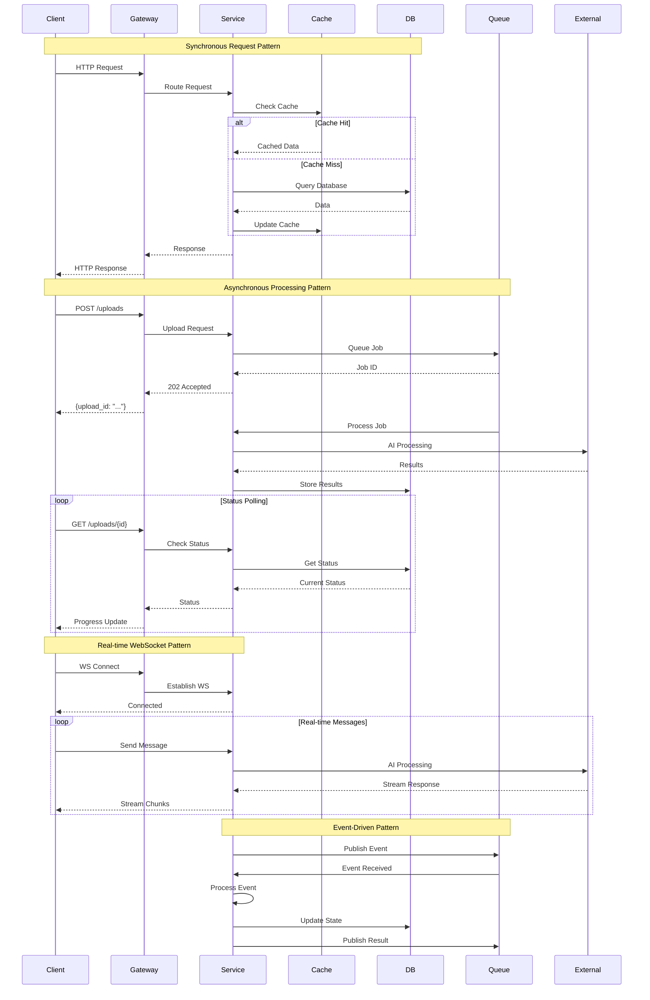
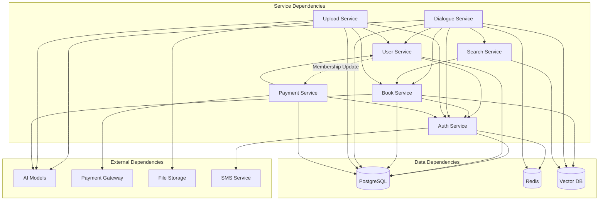

# API Architecture Diagram - InKnowing Platform

## Business Logic Conservation Mapping
This diagram shows the API structure, service relationships, and external integrations with complete endpoint mapping.

## 1. Overall API Architecture

```mermaid
graph TB
    subgraph "Client Layer"
        Web[Web App]
        Mobile[Mobile App]
        Admin[Admin Portal]
    end

    subgraph "API Gateway Layer"
        Gateway[API Gateway<br/>nginx/Kong]
        RateLimit[Rate Limiter]
        Auth[Auth Middleware]

        Gateway --> RateLimit
        RateLimit --> Auth
    end

    subgraph "Service Layer"
        subgraph "Core Services"
            AuthService[Auth Service<br/>JWT Management]
            UserService[User Service<br/>Profile & Membership]
            BookService[Book Service<br/>Catalog Management]
            DialogueService[Dialogue Service<br/>Chat Management]
            UploadService[Upload Service<br/>File Processing]
            SearchService[Search Service<br/>Discovery Engine]
        end

        subgraph "Admin Services"
            AdminAuth[Admin Auth<br/>Role Management]
            AdminBook[Book Management<br/>CRUD Operations]
            AdminStats[Statistics<br/>Analytics]
            AdminMonitor[Monitoring<br/>Health Checks]
        end

        subgraph "Support Services"
            PaymentService[Payment Service<br/>Order Management]
            NotificationService[Notification<br/>SMS/Push]
            FileService[File Storage<br/>CDN Integration]
            QueueService[Task Queue<br/>Async Jobs]
        end
    end

    subgraph "Data Layer"
        PostgreSQL[(PostgreSQL<br/>Main Database)]
        Redis[(Redis<br/>Cache & Session)]
        VectorDB[(Vector DB<br/>Pinecone/Weaviate)]
        S3[(S3/OSS<br/>File Storage)]
        MQ[Message Queue<br/>RabbitMQ/Kafka]
    end

    subgraph "External Services"
        AIModels[AI Models<br/>OpenAI/Qwen/Baidu]
        WeChatPay[WeChat Pay]
        Alipay[Alipay]
        SMS[SMS Gateway]
        WeChatAuth[WeChat Auth]
        CDN[CDN Service]
    end

    %% Client connections
    Web --> Gateway
    Mobile --> Gateway
    Admin --> Gateway

    %% Gateway to Services
    Auth --> AuthService
    Auth --> UserService
    Auth --> BookService
    Auth --> DialogueService
    Auth --> UploadService
    Auth --> SearchService
    Auth --> AdminAuth
    Auth --> PaymentService

    %% Service to Data
    AuthService --> PostgreSQL
    AuthService --> Redis
    UserService --> PostgreSQL
    UserService --> Redis
    BookService --> PostgreSQL
    BookService --> VectorDB
    DialogueService --> PostgreSQL
    DialogueService --> Redis
    DialogueService --> VectorDB
    UploadService --> S3
    UploadService --> MQ
    SearchService --> VectorDB
    SearchService --> PostgreSQL

    %% Admin Services to Data
    AdminAuth --> PostgreSQL
    AdminBook --> PostgreSQL
    AdminStats --> PostgreSQL
    AdminMonitor --> Redis

    %% Support Services
    PaymentService --> PostgreSQL
    NotificationService --> MQ
    FileService --> S3
    QueueService --> MQ

    %% External Integrations
    DialogueService --> AIModels
    UploadService --> AIModels
    AdminBook --> AIModels
    PaymentService --> WeChatPay
    PaymentService --> Alipay
    NotificationService --> SMS
    AuthService --> WeChatAuth
    FileService --> CDN

    style Gateway fill:#e1f5fe
    style PostgreSQL fill:#fff9c4
    style VectorDB fill:#f3e5f5
    style AIModels fill:#ffccbc
```

## 2. API Endpoint Routing Architecture

```mermaid
graph LR
    subgraph "API Gateway Routes"
        Root["/v1"]

        subgraph "Public Routes"
            SearchRoute["/search"]
            BooksRoute["/books"]
            AuthRoute["/auth"]
        end

        subgraph "Protected Routes"
            UsersRoute["/users"]
            DialoguesRoute["/dialogues"]
            UploadsRoute["/uploads"]
        end

        subgraph "Admin Routes"
            AdminRoute["/admin"]
        end

        subgraph "WebSocket"
            WSRoute["/ws"]
        end

        subgraph "Webhooks"
            PaymentRoute["/payment"]
        end
    end

    Root --> SearchRoute
    Root --> BooksRoute
    Root --> AuthRoute
    Root --> UsersRoute
    Root --> DialoguesRoute
    Root --> UploadsRoute
    Root --> AdminRoute
    Root --> WSRoute
    Root --> PaymentRoute

    %% Search Endpoints
    SearchRoute --> Search1["GET /<br/>Question search"]
    SearchRoute --> Search2["GET /books<br/>Title search"]

    %% Books Endpoints
    BooksRoute --> Books1["GET /<br/>List books"]
    BooksRoute --> Books2["GET /popular<br/>Popular books"]
    BooksRoute --> Books3["GET /{id}<br/>Book details"]
    BooksRoute --> Books4["GET /{id}/characters<br/>Characters"]

    %% Auth Endpoints
    AuthRoute --> Auth1["POST /register<br/>User registration"]
    AuthRoute --> Auth2["POST /login<br/>User login"]
    AuthRoute --> Auth3["POST /refresh<br/>Token refresh"]
    AuthRoute --> Auth4["POST /logout<br/>User logout"]
    AuthRoute --> Auth5["POST /verify-code<br/>SMS code"]

    %% User Endpoints
    UsersRoute --> Users1["GET /profile<br/>User profile"]
    UsersRoute --> Users2["PATCH /profile<br/>Update profile"]
    UsersRoute --> Users3["GET /membership<br/>Membership info"]
    UsersRoute --> Users4["POST /membership/upgrade<br/>Upgrade plan"]
    UsersRoute --> Users5["GET /quota<br/>Dialogue quota"]

    %% Dialogue Endpoints
    DialoguesRoute --> Dialogue1["POST /book/start<br/>Start book chat"]
    DialoguesRoute --> Dialogue2["POST /character/start<br/>Start character chat"]
    DialoguesRoute --> Dialogue3["POST /{id}/messages<br/>Send message"]
    DialoguesRoute --> Dialogue4["GET /{id}/messages<br/>Get history"]
    DialoguesRoute --> Dialogue5["GET /{id}/context<br/>Get context"]
    DialoguesRoute --> Dialogue6["GET /history<br/>User history"]

    %% Upload Endpoints
    UploadsRoute --> Upload1["POST /check<br/>Check exists"]
    UploadsRoute --> Upload2["POST /<br/>Upload file"]
    UploadsRoute --> Upload3["GET /{id}<br/>Get status"]
    UploadsRoute --> Upload4["GET /my<br/>User uploads"]

    %% Admin Endpoints
    AdminRoute --> Admin1["POST /login<br/>Admin auth"]
    AdminRoute --> Admin2["GET /dashboard<br/>Statistics"]
    AdminRoute --> Admin3["*/books<br/>Book management"]
    AdminRoute --> Admin4["*/users<br/>User management"]
    AdminRoute --> Admin5["*/models<br/>AI config"]
    AdminRoute --> Admin6["*/statistics<br/>Analytics"]

    %% WebSocket
    WSRoute --> WS1["GET /dialogue/{id}<br/>Real-time chat"]

    %% Payment Webhooks
    PaymentRoute --> Pay1["POST /callback/wechat<br/>WeChat callback"]
    PaymentRoute --> Pay2["POST /callback/alipay<br/>Alipay callback"]
    PaymentRoute --> Pay3["GET /orders/{id}<br/>Order status"]
```

## 3. Authentication & Authorization Flow

```mermaid
graph TB
    subgraph "Authentication Flow"
        Request[Incoming Request]
        Gateway[API Gateway]
        AuthMiddleware[Auth Middleware]

        Request --> Gateway
        Gateway --> AuthMiddleware

        AuthMiddleware --> CheckPublic{Public Route?}
        CheckPublic -->|Yes| AllowPublic[Allow Access]
        CheckPublic -->|No| CheckToken{Has Token?}

        CheckToken -->|No| Return401[401 Unauthorized]
        CheckToken -->|Yes| ValidateToken{Valid Token?}

        ValidateToken -->|No| Return401
        ValidateToken -->|Yes| CheckRole{Role Check}

        CheckRole --> UserRole{User Role?}
        UserRole -->|Regular| CheckQuota{Quota Check}
        UserRole -->|Admin| CheckAdminPerms{Admin Perms?}

        CheckQuota -->|Available| AllowUser[Allow Access]
        CheckQuota -->|Exceeded| Return403[403 Forbidden]

        CheckAdminPerms -->|Valid| AllowAdmin[Allow Access]
        CheckAdminPerms -->|Invalid| Return403
    end

    subgraph "Token Management"
        Login[Login Success]
        Login --> GenerateTokens[Generate Tokens]
        GenerateTokens --> AccessToken[Access Token<br/>15 min]
        GenerateTokens --> RefreshToken[Refresh Token<br/>7 days]

        AccessToken --> StoreRedis[Store in Redis]
        RefreshToken --> StoreDB[Store in DB]

        TokenExpired[Token Expired]
        TokenExpired --> UseRefresh[Use Refresh Token]
        UseRefresh --> NewAccessToken[New Access Token]
    end

    subgraph "Rate Limiting"
        RateCheck[Check Rate Limit]
        RateCheck --> UserTier{User Tier}

        UserTier -->|Free| FreeLimit[20/day]
        UserTier -->|Basic| BasicLimit[200/month]
        UserTier -->|Premium| PremiumLimit[500/month]
        UserTier -->|Super| SuperLimit[1000/month]

        FreeLimit --> CheckLimit{Within Limit?}
        BasicLimit --> CheckLimit
        PremiumLimit --> CheckLimit
        SuperLimit --> CheckLimit

        CheckLimit -->|Yes| AllowRequest[Process Request]
        CheckLimit -->|No| Return429[429 Too Many Requests]
    end
```

## 4. Service Communication Patterns

## 5. API Service Dependencies

## API Endpoint Categories & Responsibilities

| Service | Endpoints | Responsibility | Dependencies |
|---------|-----------|----------------|--------------|
| **Auth Service** | `/auth/*` | Authentication, JWT management | PostgreSQL, Redis, SMS |
| **User Service** | `/users/*` | Profile, membership, quota | Auth Service, PostgreSQL |
| **Book Service** | `/books/*` | Book catalog, characters | PostgreSQL, Vector DB, AI |
| **Search Service** | `/search/*` | Discovery, semantic search | Vector DB, Book Service |
| **Dialogue Service** | `/dialogues/*`, `/ws/*` | Chat sessions, AI interaction | User Service, Book Service, AI |
| **Upload Service** | `/uploads/*` | File processing, vectorization | S3, AI, Queue, Book Service |
| **Payment Service** | `/payment/*` | Order management, callbacks | Payment Gateways, User Service |
| **Admin Service** | `/admin/*` | Management, monitoring | All services |

## Business Logic Conservation in Architecture

1. **Service Isolation**: Each service owns its business domain
2. **API Gateway**: Central routing and cross-cutting concerns
3. **Async Processing**: Long-running tasks use queue pattern
4. **Caching Strategy**: Redis for sessions, frequent queries
5. **Vector Search**: Semantic search for question-book matching
6. **Real-time Support**: WebSocket for interactive dialogues
7. **External Integration**: Clean boundaries with external services
8. **Monitoring**: Health checks and metrics at each layer

## Security & Performance Considerations

| Layer | Security | Performance |
|-------|----------|-------------|
| **Gateway** | Rate limiting, DDoS protection | Load balancing, caching |
| **Services** | JWT validation, role checks | Connection pooling, async I/O |
| **Data** | Encryption at rest, access control | Indexing, query optimization |
| **External** | API key management, webhooks | Circuit breakers, retries |