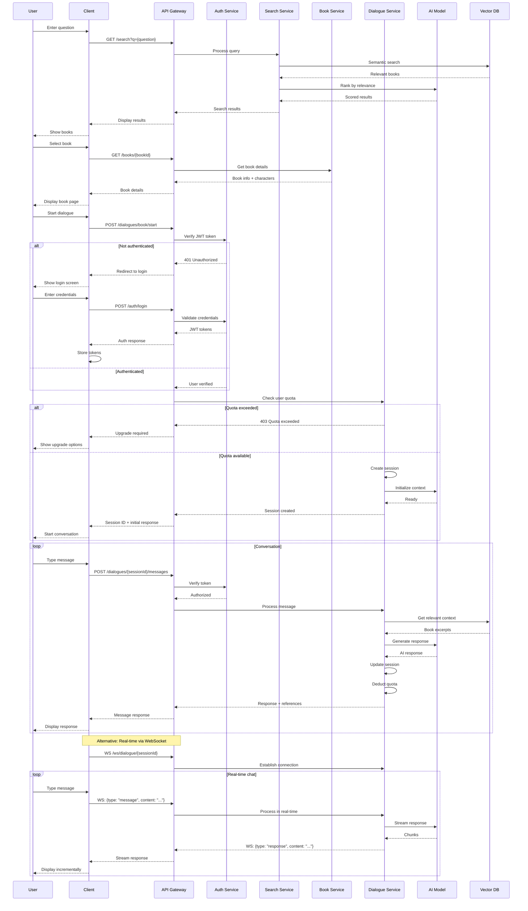
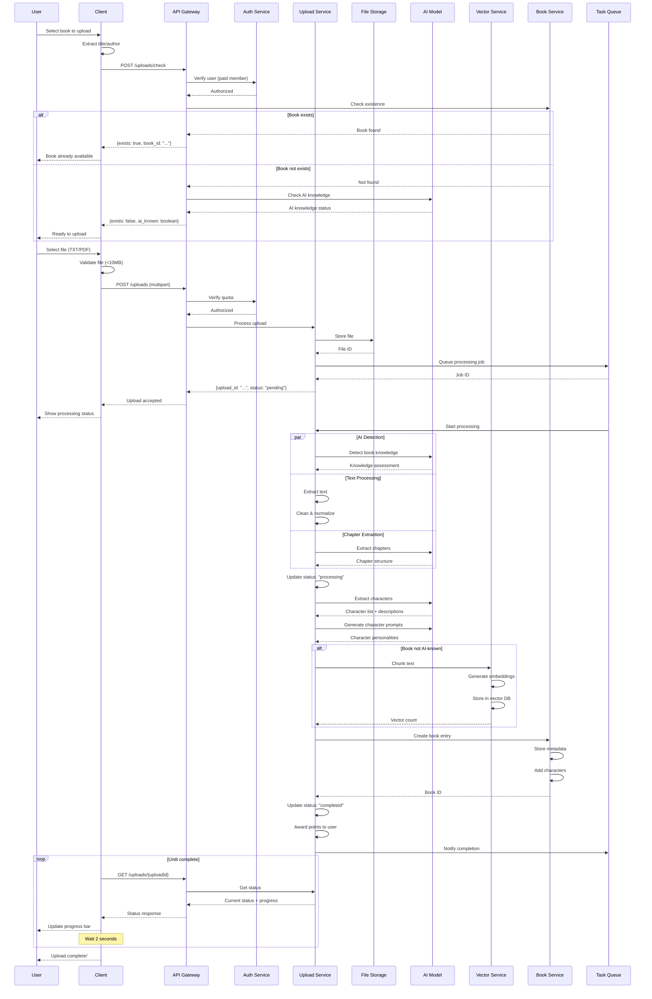
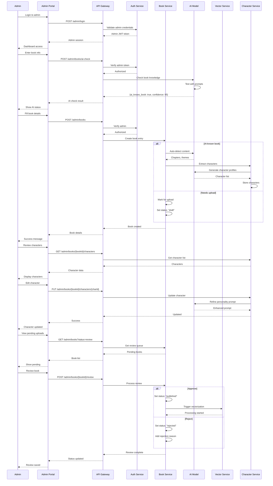
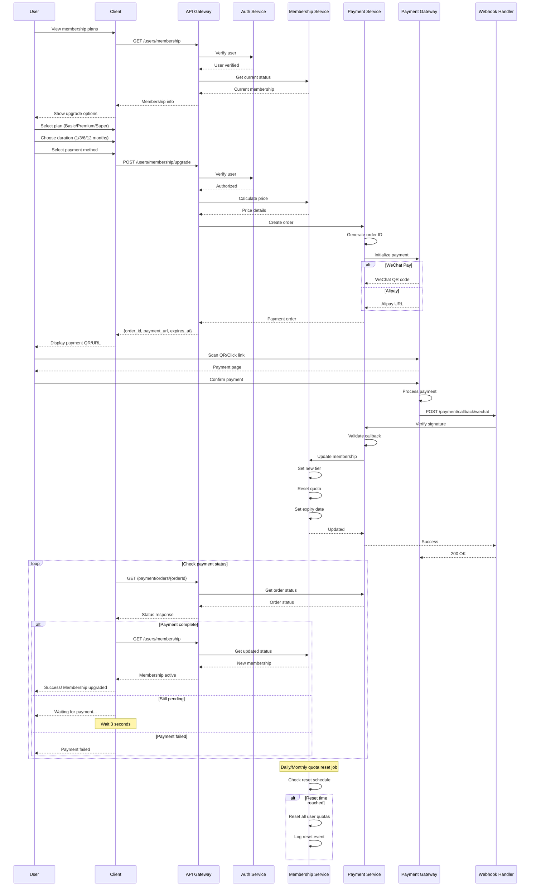

# System Sequence Diagrams - InKnowing Platform

## Business Logic Conservation Mapping
These sequence diagrams show the temporal flow of API calls for key system processes.

## 1. User Search and Dialogue Flow

## 2. Book Upload and Processing Flow

## 3. Admin Book Creation Flow

## 4. Payment Processing Flow

## API Call Sequences Summary

| Flow | Key API Sequence | Business Logic |
|------|-----------------|----------------|
| **Question Search** | `/search` → `/books/{id}` → `/dialogues/book/start` → `/dialogues/{id}/messages` | Discovery → Selection → Interaction |
| **Character Chat** | `/books/{id}/characters` → `/dialogues/character/start` → `/ws/dialogue/{id}` | Character selection → Immersive dialogue |
| **Book Upload** | `/uploads/check` → `/uploads` → `/uploads/{id}` (polling) | Duplicate check → Processing → Availability |
| **Admin Creation** | `/admin/books/ai-check` → `/admin/books` → `/admin/books/{id}/characters` | AI detection → Creation → Character setup |
| **Payment Flow** | `/users/membership/upgrade` → `/payment/callback/*` → `/users/membership` | Order → Payment → Activation |

## Business Logic Conservation Notes

1. **Temporal Consistency**: API calls follow logical time sequence
2. **State Verification**: Each step validates prerequisites (auth, quota, permissions)
3. **Async Patterns**: Long-running operations use polling or webhooks
4. **Error Handling**: Each interaction includes failure paths
5. **Resource Optimization**: WebSocket for real-time, REST for transactional