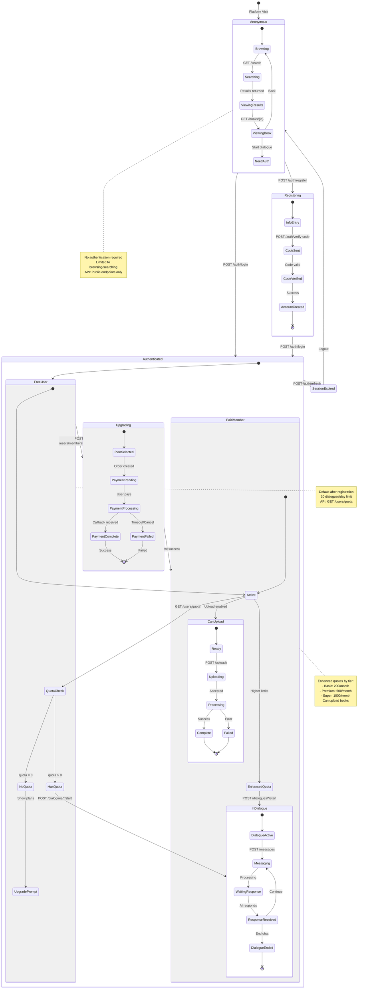
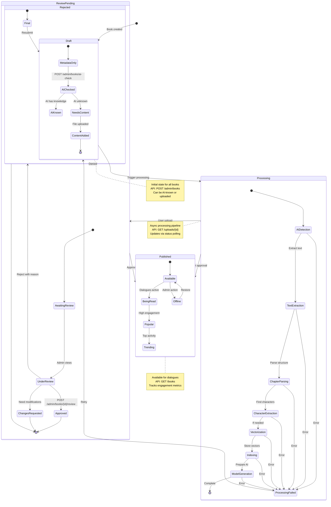
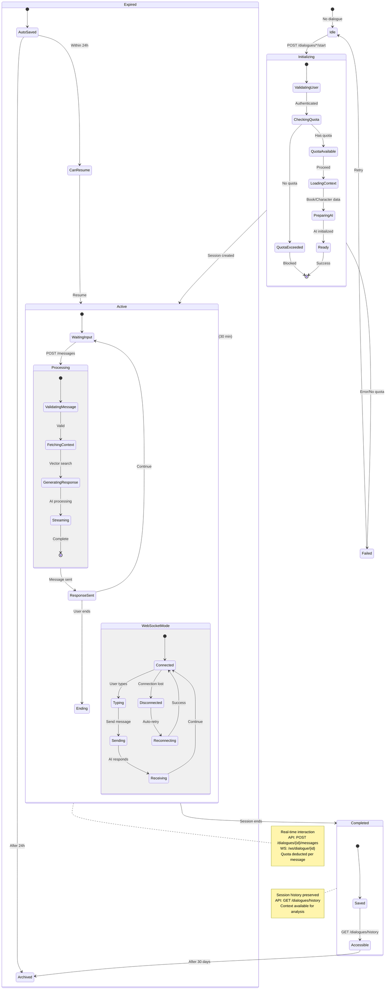
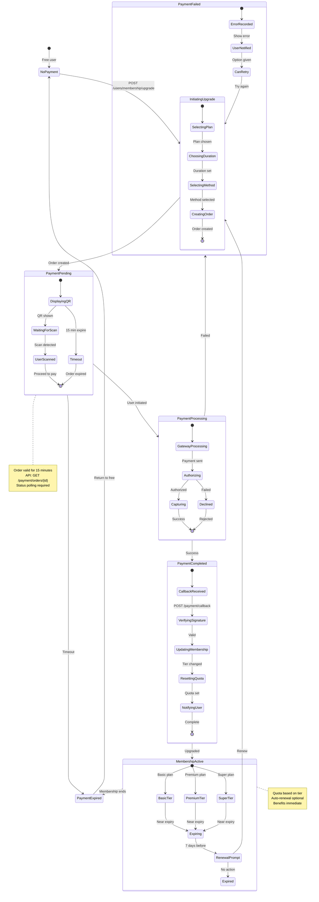

# State Diagrams - InKnowing Platform

## Business Logic Conservation Mapping
These state diagrams show system state transitions with complete API endpoint mapping.

## 1. User State Transitions

## 2. Book State Transitions

## 3. Dialogue State Transitions

## 4. Upload State Transitions

```mermaid
stateDiagram-v2
    [*] --> Ready: User on upload page

    Ready --> Checking: POST /uploads/check

    state Checking {
        [*] --> QueryingDB
        QueryingDB --> BookExists: Found
        QueryingDB --> BookNew: Not found
        BookExists --> [*]: Use existing
        BookNew --> CheckingAI: Check AI
        CheckingAI --> AIKnows: AI has it
        CheckingAI --> NeedUpload: AI doesn't know
        AIKnows --> [*]: Suggest AI mode
        NeedUpload --> [*]: Proceed upload
    }

    Checking --> Uploading: Proceed
    Checking --> Aborted: Book exists

    state Uploading {
        [*] --> SelectingFile
        SelectingFile --> ValidatingFile: File chosen
        ValidatingFile --> FileValid: Pass checks
        ValidatingFile --> FileInvalid: Fail checks
        FileValid --> Transmitting: POST /uploads
        Transmitting --> [*]: Complete
        FileInvalid --> SelectingFile: Retry
    }

    Uploading --> Processing: File received

    state Processing {
        [*] --> Pending
        Pending --> AIDetection: Start

        state AIDetection {
            [*] --> TestingKnowledge
            TestingKnowledge --> Known: AI recognizes
            TestingKnowledge --> Unknown: AI doesn't know
            Known --> [*]: Skip vectorization
            Unknown --> [*]: Need vectorization
        }

        AIDetection --> TextProcessing

        state TextProcessing {
            [*] --> Extracting
            Extracting --> Cleaning: Raw text
            Cleaning --> Normalizing: Clean text
            Normalizing --> [*]: Ready
        }

        TextProcessing --> ChapterExtraction

        state ChapterExtraction {
            [*] --> Parsing
            Parsing --> Structuring: Find chapters
            Structuring --> [*]: Chapters ready
        }

        ChapterExtraction --> CharacterExtraction

        state CharacterExtraction {
            [*] --> Analyzing
            Analyzing --> Identifying: Find names
            Identifying --> Profiling: Build profiles
            Profiling --> [*]: Characters ready
        }

        CharacterExtraction --> Vectorization

        state Vectorization {
            [*] --> Chunking
            Chunking --> Embedding: Create chunks
            Embedding --> Storing: Generate vectors
            Storing --> [*]: Indexed
        }

        Vectorization --> Finalizing
        Finalizing --> [*]: Complete
    }

    Processing --> Completed: Success
    Processing --> Failed: Error

    state Completed {
        [*] --> BookCreated
        BookCreated --> PointsAwarded: Reward user
        PointsAwarded --> Available: Book live
    }

    state Failed {
        [*] --> ErrorLogged
        ErrorLogged --> CanRetry: User notified
        CanRetry --> Ready: Try again
    }

    note right of Processing
        Async pipeline
        API: GET /uploads/{id}
        Status updates via polling
        Each step logged
    end note

    note right of Completed
        Book available immediately
        Points added to user account
        Upload history preserved
    end note
```

## 5. Payment State Transitions

## State Transition API Mapping

| State Category | Transition | API Trigger | Business Rule |
|---------------|------------|-------------|---------------|
| **User States** |
| Anonymous → Registered | Registration | POST /auth/register | Phone/WeChat required |
| Registered → Authenticated | Login | POST /auth/login | Valid credentials |
| Free → Paid | Upgrade | POST /users/membership/upgrade | Payment success |
| Session → Expired | Timeout | N/A | 24h token expiry |
| **Book States** |
| Draft → Processing | Start process | Admin action | Content ready |
| Processing → Published | Complete | Auto/Admin | All steps pass |
| Published → Offline | Disable | PUT /admin/books/{id} | Admin only |
| **Dialogue States** |
| Idle → Active | Start chat | POST /dialogues/*/start | Quota available |
| Active → Completed | End chat | User action | Manual/Timeout |
| Active → Expired | Timeout | System | 30 min inactive |
| **Upload States** |
| Ready → Uploading | Select file | POST /uploads | File valid |
| Uploading → Processing | Upload done | System | File received |
| Processing → Completed | Process done | System | All steps pass |
| Processing → Failed | Error | System | Step failure |
| **Payment States** |
| None → Pending | Create order | POST /membership/upgrade | Plan selected |
| Pending → Processing | User pays | Gateway | Scan QR/Link |
| Processing → Completed | Success | Callback | Payment verified |
| Completed → Active | Activate | System | Membership updated |

## Business Logic Conservation Notes

1. **State Integrity**: Every state transition has clear entry/exit conditions
2. **API Consistency**: Each transition maps to specific API operations
3. **Rollback Safety**: Failed states have recovery paths
4. **Audit Trail**: All transitions are logged for tracking
5. **Business Rules**: State guards enforce business constraints