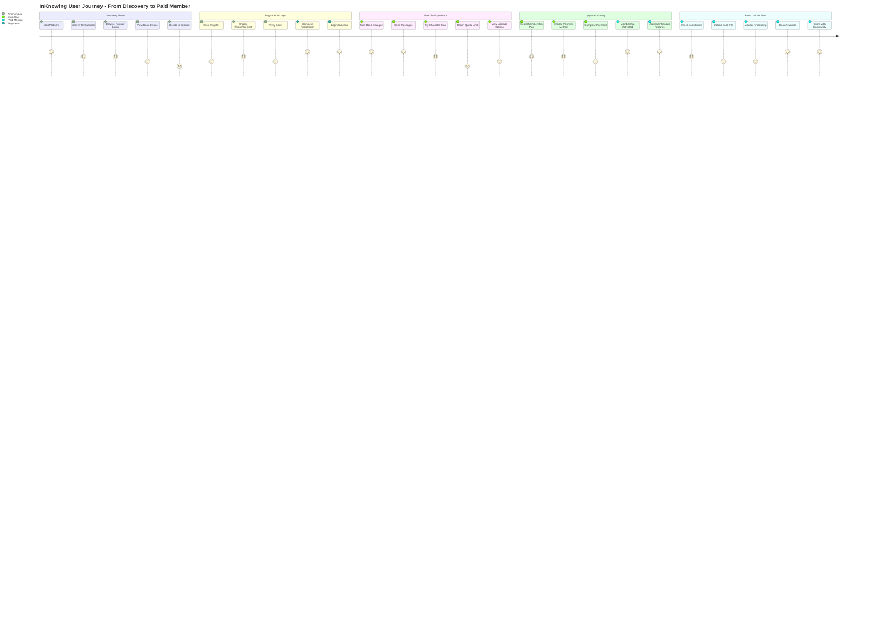
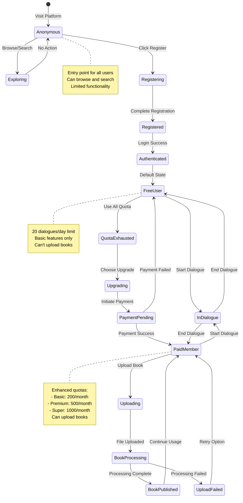

# User Journey Diagram - InKnowing Platform

## Business Logic Conservation Mapping
This diagram shows the complete user flow from discovery to paid usage, with each user action mapped to corresponding API endpoints.



## Detailed User Journey with API Mappings

```mermaid
flowchart TB
    Start([Anonymous User]) --> Discover{Discovery Method}

    Discover -->|Question-Driven| Search[Search by Question<br/>API: GET /search?q=...]
    Discover -->|Book-Driven| Browse[Browse Books<br/>API: GET /books<br/>GET /books/popular]

    Search --> Results[View Search Results<br/>Relevance Scores]
    Browse --> BookList[View Book List<br/>Categories & Ratings]

    Results --> BookDetail[View Book Details<br/>API: GET /books/{bookId}]
    BookList --> BookDetail

    BookDetail --> Interact{Want to Interact?}

    Interact -->|No| Continue[Continue Browsing]
    Interact -->|Yes| AuthCheck{Authenticated?}

    AuthCheck -->|No| Register[Registration<br/>API: POST /auth/register]
    AuthCheck -->|Yes| StartDialogue

    Register --> VerifyCode[Verify Code<br/>API: POST /auth/verify-code]
    VerifyCode --> Login[Login<br/>API: POST /auth/login]

    Login --> UserProfile[Get Profile<br/>API: GET /users/profile]
    UserProfile --> QuotaCheck[Check Quota<br/>API: GET /users/quota]

    QuotaCheck --> StartDialogue{Start Dialogue}

    StartDialogue -->|Book Chat| BookChat[Start Book Dialogue<br/>API: POST /dialogues/book/start]
    StartDialogue -->|Character Chat| CharSelect[Select Character<br/>API: GET /books/{bookId}/characters]

    CharSelect --> CharChat[Start Character Dialogue<br/>API: POST /dialogues/character/start]

    BookChat --> Messaging[Send Messages<br/>API: POST /dialogues/{sessionId}/messages<br/>WS: /ws/dialogue/{sessionId}]
    CharChat --> Messaging

    Messaging --> QuotaUsed{Quota Status}

    QuotaUsed -->|Available| Messaging
    QuotaUsed -->|Exhausted| UpgradePrompt[Upgrade Prompt<br/>API: GET /users/membership]

    UpgradePrompt --> UpgradePlan[Select Plan<br/>API: POST /users/membership/upgrade]

    UpgradePlan --> Payment[Payment Process<br/>Payment Gateway]

    Payment --> PaymentCallback[Payment Callback<br/>API: POST /payment/callback/*]

    PaymentCallback --> MembershipActive[Membership Active<br/>API: GET /users/membership]

    MembershipActive --> EnhancedFeatures[Access Enhanced Features]

    EnhancedFeatures --> Upload{Upload Book?}

    Upload -->|Yes| CheckExists[Check Book Exists<br/>API: POST /uploads/check]
    Upload -->|No| ContinueChat[Continue Dialogues]

    CheckExists -->|Exists| UseExisting[Use Existing Book]
    CheckExists -->|Not Exists| UploadFile[Upload File<br/>API: POST /uploads]

    UploadFile --> Processing[Monitor Processing<br/>API: GET /uploads/{uploadId}]

    Processing -->|Processing| Processing
    Processing -->|Complete| BookReady[Book Ready<br/>Points Earned]

    BookReady --> ShareCommunity[Share with Community]

    style Start fill:#e1f5fe
    style MembershipActive fill:#c8e6c9
    style BookReady fill:#fff9c4
    style Payment fill:#ffccbc
```

## User State Transitions



## API Endpoint Mapping to User Actions

| User Action | API Endpoint | Business Logic |
|------------|--------------|----------------|
| **Discovery Phase** |
| Search by question | GET /search?q={question} | Question → Book discovery |
| Browse books | GET /books | Book catalog exploration |
| View popular | GET /books/popular | Trending content discovery |
| Book details | GET /books/{bookId} | Detailed information retrieval |
| **Authentication** |
| Register | POST /auth/register | User account creation |
| Send verification | POST /auth/verify-code | Phone number verification |
| Login | POST /auth/login | Session establishment |
| Refresh token | POST /auth/refresh | Session maintenance |
| **Dialogue Experience** |
| Start book chat | POST /dialogues/book/start | Initialize AI conversation |
| Start character chat | POST /dialogues/character/start | Character roleplay session |
| Send message | POST /dialogues/{id}/messages | Conversation interaction |
| WebSocket chat | WS /ws/dialogue/{sessionId} | Real-time messaging |
| View history | GET /dialogues/history | Past conversations |
| **Membership** |
| Check quota | GET /users/quota | Usage monitoring |
| View membership | GET /users/membership | Status verification |
| Upgrade plan | POST /users/membership/upgrade | Payment initiation |
| Payment callback | POST /payment/callback/* | Payment confirmation |
| **Book Upload** |
| Check existence | POST /uploads/check | Duplicate prevention |
| Upload file | POST /uploads | Content contribution |
| Check status | GET /uploads/{uploadId} | Processing monitoring |
| View uploads | GET /uploads/my | Upload management |

## Business Logic Conservation Notes

1. **Complete Traceability**: Every user action maps to specific API endpoints
2. **State Consistency**: User state transitions are reflected in API responses
3. **Quota Management**: Built into dialogue initiation and message sending
4. **Progressive Enhancement**: Features unlock based on membership tier
5. **Async Processing**: Upload flow uses polling pattern for status updates