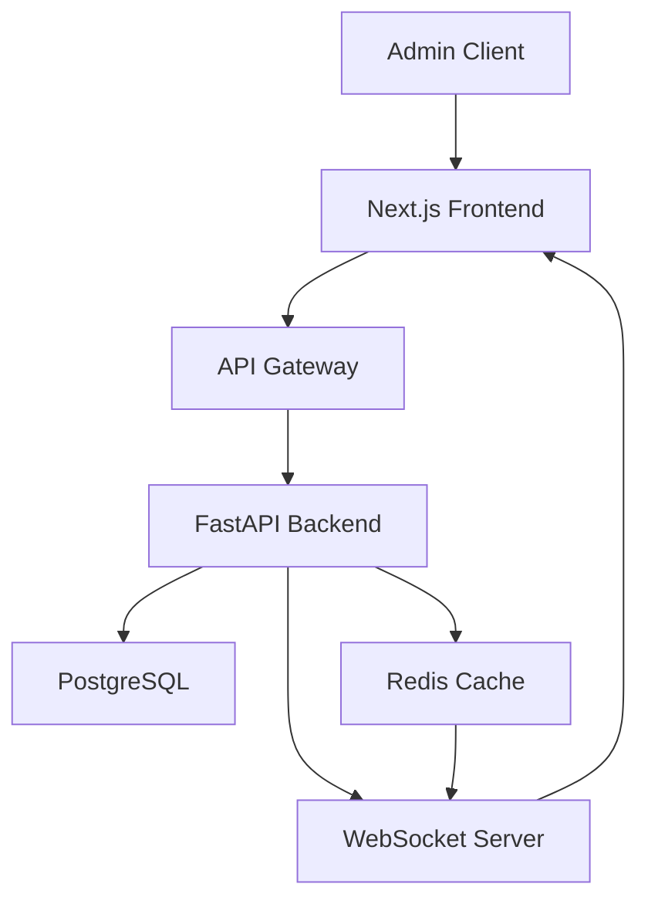

# 管理后台需求分析报告

## 一、执行摘要

本报告通过分析任务文档、现有代码实现和三图一端文档，为InKnowing管理后台的开发提供全面的需求分析和技术建议。

### 关键发现
- ✅ **基础架构已搭建**：前后端管理后台框架已初步建立
- ⚠️ **功能实现不完整**：核心功能大部分未实现或未完全实现
- ❌ **缺少关键模块**：登录认证、权限管理、数据可视化等核心模块缺失
- 🔄 **需要重构优化**：现有代码需要按照任务文档要求进行重构

## 二、需求分析

### 2.1 业务需求

根据task文档分析，管理后台需要满足以下核心业务需求：

#### 核心功能模块
1. **身份认证与授权**
   - 管理员登录/登出
   - JWT Token认证
   - 角色权限管理（super_admin、admin、moderator）
   - 操作审计日志

2. **仪表盘监控**
   - 实时数据统计（在线用户、活跃对话、API状态）
   - 今日数据概览（新增用户、对话总数、新增书籍、API成本）
   - 趋势分析图表
   - 系统健康监控

3. **内容管理**
   - 书籍管理（审核、编辑、删除）
   - 用户管理（查看、封禁、会员管理）
   - 对话审核
   - 角色人物管理

4. **系统配置**
   - AI模型配置
   - 参数设置
   - 功能开关
   - 定价策略

5. **数据统计与分析**
   - 使用报告
   - 成本分析
   - 收入统计
   - 用户增长趋势

### 2.2 技术需求

#### 前端技术栈
- Next.js 14 + TypeScript
- React Hooks + Zustand
- TailwindCSS + shadcn/ui
- Recharts/Chart.js（数据可视化）
- WebSocket（实时数据）

#### 后端技术栈
- FastAPI + Python
- SQLModel + PostgreSQL
- Redis（缓存和实时数据）
- JWT认证
- WebSocket支持

## 三、现有代码评估

### 3.1 前端实现状态

#### ✅ 已实现
1. **基础页面结构**
   - `/frontend/src/app/admin/` 目录结构已创建
   - 页面布局组件 `layout.tsx`
   - 主仪表盘页面 `page.tsx`

2. **组件库**
   - 统计卡片组件 `stats-cards.tsx`
   - 增长图表组件 `growth-chart.tsx`
   - 系统健康组件 `system-health.tsx`
   - 最近活动组件 `recent-activity.tsx`
   - 快速操作组件 `quick-actions.tsx`

3. **API接口封装**
   - 管理员API客户端 `admin-api.ts`
   - 数据类型定义

#### ❌ 未实现/需要完善
1. **认证系统**
   - 缺少登录页面
   - 缺少认证中间件
   - 缺少Token管理

2. **核心功能页面**
   - 用户管理页面（空壳）
   - 内容管理页面（空壳）
   - 分析统计页面（空壳）
   - 系统设置页面（空壳）

3. **数据可视化**
   - 缺少实际的图表实现
   - 缺少实时数据更新逻辑

### 3.2 后端实现状态

#### ✅ 已实现
1. **基础架构**
   - Admin路由定义 `/backend/api/v1/admin.py`
   - Admin模型定义 `/backend/models/admin.py`
   - Admin服务层 `/backend/services/admin.py`
   - 认证服务 `/backend/services/admin_auth.py`

2. **数据模型**
   - Admin表结构
   - 角色权限枚举
   - 审计日志模型

3. **API端点框架**
   - 登录端点框架
   - 权限检查装饰器
   - 基础CRUD框架

#### ❌ 未实现/需要完善
1. **核心API功能**
   - 仪表盘统计数据聚合
   - 用户管理CRUD操作
   - 书籍审核流程
   - 系统配置管理

2. **实时功能**
   - WebSocket连接管理
   - 实时数据推送
   - 在线状态追踪

3. **数据层**
   - 缺少Redis集成
   - 缺少数据缓存策略
   - 缺少定时任务

## 四、缺失功能列表

### 高优先级（P0）
1. ❌ **管理员登录页面和流程**
2. ❌ **JWT Token认证机制**
3. ❌ **仪表盘数据聚合API**
4. ❌ **基础权限控制**

### 中优先级（P1）
1. ❌ **用户管理完整功能**
2. ❌ **书籍审核流程**
3. ❌ **实时数据WebSocket**
4. ❌ **操作审计日志**
5. ❌ **数据统计图表**

### 低优先级（P2）
1. ❌ **高级数据分析**
2. ❌ **导出报表功能**
3. ❌ **批量操作功能**
4. ❌ **自定义仪表盘**
5. ❌ **通知系统**

## 五、技术架构建议

### 5.1 前端架构

```typescript
frontend/src/
├── app/
│   └── admin/
│       ├── (auth)/          # 认证相关
│       │   ├── login/
│       │   └── logout/
│       ├── (dashboard)/      # 主面板
│       │   ├── page.tsx
│       │   └── components/
│       ├── users/           # 用户管理
│       ├── books/           # 书籍管理
│       ├── analytics/       # 数据分析
│       └── settings/        # 系统设置
├── components/
│   └── admin/
│       ├── auth/           # 认证组件
│       ├── charts/         # 图表组件
│       ├── tables/         # 表格组件
│       └── forms/          # 表单组件
├── lib/
│   ├── admin-api.ts        # API客户端
│   └── admin-auth.ts       # 认证工具
└── stores/
    └── admin-store.ts      # 状态管理
```

### 5.2 后端架构

```python
backend/
├── api/v1/
│   └── admin/
│       ├── __init__.py
│       ├── auth.py         # 认证端点
│       ├── dashboard.py    # 仪表盘端点
│       ├── users.py        # 用户管理
│       ├── books.py        # 书籍管理
│       └── analytics.py    # 数据分析
├── services/
│   └── admin/
│       ├── auth_service.py
│       ├── dashboard_service.py
│       ├── analytics_service.py
│       └── audit_service.py
├── models/
│   ├── admin.py
│   └── audit_log.py
└── middleware/
    └── admin_auth.py
```

### 5.3 数据流架构



## 六、开发路线图

### Phase 1：基础功能（第1-2周）
**目标**：实现基本的认证和仪表盘

#### Week 1
- [ ] 实现管理员登录页面
- [ ] 完成JWT认证流程
- [ ] 实现基础权限检查
- [ ] 创建仪表盘数据聚合API

#### Week 2
- [ ] 完成仪表盘UI实现
- [ ] 添加实时数据展示
- [ ] 实现基础统计图表
- [ ] 添加系统健康监控

### Phase 2：核心管理（第3-4周）
**目标**：实现用户和内容管理

#### Week 3
- [ ] 实现用户管理CRUD
- [ ] 添加用户搜索和筛选
- [ ] 实现会员管理功能
- [ ] 添加用户封禁/解封

#### Week 4
- [ ] 实现书籍管理功能
- [ ] 添加书籍审核流程
- [ ] 实现对话审核功能
- [ ] 添加内容举报处理

### Phase 3：高级功能（第5-6周）
**目标**：实现数据分析和系统配置

#### Week 5
- [ ] 实现数据分析页面
- [ ] 添加导出报表功能
- [ ] 实现成本分析
- [ ] 添加收入统计

#### Week 6
- [ ] 实现系统配置管理
- [ ] 添加AI模型配置
- [ ] 实现操作审计日志
- [ ] 性能优化和测试

## 七、技术建议

### 7.1 安全性建议
1. **认证安全**
   - 实现双因素认证（2FA）
   - IP白名单限制
   - 登录失败次数限制
   - Session管理

2. **数据安全**
   - 敏感数据加密存储
   - API访问速率限制
   - CORS配置
   - SQL注入防护

### 7.2 性能优化建议
1. **前端优化**
   - 组件懒加载
   - 数据虚拟滚动
   - 图表数据采样
   - 缓存策略

2. **后端优化**
   - 数据库查询优化
   - Redis缓存策略
   - 异步任务队列
   - 数据聚合优化

### 7.3 可维护性建议
1. **代码规范**
   - TypeScript严格模式
   - ESLint + Prettier
   - 单元测试覆盖
   - API文档自动生成

2. **监控告警**
   - 错误日志收集
   - 性能监控
   - 业务指标告警
   - 定期健康检查

## 八、风险评估

### 技术风险
| 风险项 | 影响程度 | 概率 | 缓解措施 |
|--------|----------|------|----------|
| WebSocket连接不稳定 | 高 | 中 | 实现降级方案，轮询备用 |
| 数据量过大导致性能问题 | 高 | 高 | 分页、缓存、数据采样 |
| 权限系统漏洞 | 高 | 低 | 完整测试、安全审计 |
| 实时数据延迟 | 中 | 中 | 优化查询、增加缓存 |

### 业务风险
| 风险项 | 影响程度 | 概率 | 缓解措施 |
|--------|----------|------|----------|
| 功能范围蔓延 | 中 | 高 | 严格按照MVP范围开发 |
| 用户体验不佳 | 中 | 中 | 持续收集反馈、迭代优化 |
| 数据准确性问题 | 高 | 低 | 数据校验、定期审计 |

## 九、结论与建议

### 立即行动项
1. **完成认证系统**：这是所有功能的基础
2. **实现仪表盘API**：提供核心数据支撑
3. **补充前端页面**：完善用户交互界面
4. **添加WebSocket**：支持实时数据更新

### 长期规划
1. 建立完整的权限体系
2. 实现自动化运维功能
3. 添加AI辅助决策功能
4. 构建数据分析平台

### 成功标准
- 管理员可以正常登录和操作
- 仪表盘数据准确且实时
- 核心管理功能完整可用
- 系统稳定性达到99.9%
- 页面加载时间<2秒

## 十、附录

### 相关文档
- `task/frontend/admin/task-admin-001.md`：前端任务文档
- `task/api/admin/task-admin-001.md`：后端任务文档
- `.futurxlab/`：三图一端业务文档
- `backend/thomas-dev-note-admin-api.md`：后端开发笔记

### 技术参考
- [Next.js Admin Dashboard](https://nextjs.org/examples)
- [FastAPI Security](https://fastapi.tiangolo.com/tutorial/security/)
- [JWT Best Practices](https://tools.ietf.org/html/rfc8725)
- [WebSocket in Production](https://websocket.org/guides/)

---

*报告生成时间：2025-09-23*
*作者：Thomas - FuturX Development Engineer*
*版本：v1.0*