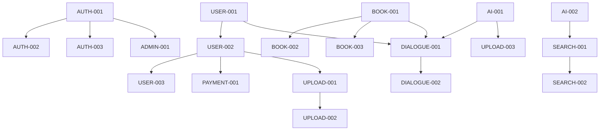

# InKnowing API Development Tasks

## Overview
This directory contains detailed task documents for implementing the InKnowing API platform. Each task is atomic, testable, and includes all necessary information for implementation.

## Task Structure
```
task/api/
├── auth/          # Authentication & Authorization tasks
├── user/          # User Management tasks
├── book/          # Book Management tasks
├── dialogue/      # Dialogue System tasks
├── search/        # Search System tasks
├── upload/        # Upload System tasks
├── admin/         # Admin Dashboard tasks
├── payment/       # Payment Integration tasks
├── ai-model/      # AI Model Integration tasks
└── monitoring/    # Monitoring & Statistics tasks
```

## Priority Levels
- **P0-Critical**: Core functionality, must be completed first
- **P1-High**: Important features, needed for MVP
- **P2-Medium**: Enhanced features, improves user experience
- **P3-Low**: Nice-to-have features, can be deferred

## Module Overview and Tasks

### 1. Authentication & Authorization (P0)
Foundation for user identity and access control.

| Task ID | Title | Priority | Est. Hours | Dependencies |
|---------|-------|----------|------------|--------------|
| AUTH-001 | JWT Token Management System | P0 | 8-12 | None |
| AUTH-002 | Phone/SMS Authentication | P0 | 6-8 | AUTH-001 |
| AUTH-003 | WeChat OAuth Integration | P0 | 8-10 | AUTH-001 |
| AUTH-004 | Admin Authentication | P0 | 4-6 | AUTH-001 |
| AUTH-005 | Rate Limiting & Security | P1 | 6-8 | AUTH-001 |

### 2. User Management (P0)
User profiles, memberships, and quota management.

| Task ID | Title | Priority | Est. Hours | Dependencies |
|---------|-------|----------|------------|--------------|
| USER-001 | User Model and Repository | P0 | 6-8 | None |
| USER-002 | Membership Management System | P0 | 10-12 | USER-001 |
| USER-003 | Quota Management System | P0 | 8-10 | USER-001, USER-002 |
| USER-004 | User Profile Management | P1 | 4-6 | USER-001 |
| USER-005 | Points System | P2 | 6-8 | USER-001 |

### 3. Book Management (P0)
Book catalog, metadata, and character management.

| Task ID | Title | Priority | Est. Hours | Dependencies |
|---------|-------|----------|------------|--------------|
| BOOK-001 | Book Model and Repository | P0 | 6-8 | None |
| BOOK-002 | Book Catalog Management | P0 | 8-10 | BOOK-001 |
| BOOK-003 | Character Management | P0 | 8-10 | BOOK-001 |
| BOOK-004 | Book Categories & Tags | P1 | 4-6 | BOOK-001 |
| BOOK-005 | Popular Books Algorithm | P2 | 6-8 | BOOK-001 |

### 4. Dialogue System (P0)
Core chat functionality with books and characters.

| Task ID | Title | Priority | Est. Hours | Dependencies |
|---------|-------|----------|------------|--------------|
| DIALOGUE-001 | Core Dialogue System | P0 | 16-20 | USER-001, BOOK-001 |
| DIALOGUE-002 | WebSocket Real-time Chat | P0 | 10-12 | DIALOGUE-001 |
| DIALOGUE-003 | Context Management | P0 | 8-10 | DIALOGUE-001 |
| DIALOGUE-004 | Message History | P1 | 6-8 | DIALOGUE-001 |
| DIALOGUE-005 | Reference Extraction | P1 | 8-10 | DIALOGUE-001, AI-002 |

### 5. Search System (P0)
Question-driven and book discovery search.

| Task ID | Title | Priority | Est. Hours | Dependencies |
|---------|-------|----------|------------|--------------|
| SEARCH-001 | Semantic Search Engine | P0 | 12-16 | AI-002 |
| SEARCH-002 | Question to Book Matching | P0 | 10-12 | SEARCH-001, AI-001 |
| SEARCH-003 | Book Title Search | P1 | 4-6 | BOOK-001 |
| SEARCH-004 | Search Ranking Algorithm | P1 | 8-10 | SEARCH-001 |
| SEARCH-005 | Search Analytics | P2 | 6-8 | SEARCH-001 |

### 6. Upload System (P1)
User book upload and processing pipeline.

| Task ID | Title | Priority | Est. Hours | Dependencies |
|---------|-------|----------|------------|--------------|
| UPLOAD-001 | File Upload Handler | P1 | 6-8 | USER-002 |
| UPLOAD-002 | Text Extraction Pipeline | P1 | 10-12 | UPLOAD-001 |
| UPLOAD-003 | Chapter & Character Extraction | P1 | 12-14 | UPLOAD-002, AI-001 |
| UPLOAD-004 | Vectorization Pipeline | P1 | 10-12 | UPLOAD-002, AI-002 |
| UPLOAD-005 | Upload Status Tracking | P1 | 6-8 | UPLOAD-001 |

### 7. Admin Dashboard (P1)
Administrative functions and content management.

| Task ID | Title | Priority | Est. Hours | Dependencies |
|---------|-------|----------|------------|--------------|
| ADMIN-001 | Admin Authentication | P1 | 4-6 | AUTH-001 |
| ADMIN-002 | Book Management Interface | P1 | 8-10 | BOOK-001, ADMIN-001 |
| ADMIN-003 | User Management Interface | P1 | 8-10 | USER-001, ADMIN-001 |
| ADMIN-004 | Upload Review System | P1 | 10-12 | UPLOAD-001, ADMIN-001 |
| ADMIN-005 | Statistics Dashboard | P2 | 12-14 | ADMIN-001 |

### 8. Payment Integration (P1)
Payment processing and order management.

| Task ID | Title | Priority | Est. Hours | Dependencies |
|---------|-------|----------|------------|--------------|
| PAYMENT-001 | Payment Gateway Integration | P1 | 12-16 | USER-002 |
| PAYMENT-002 | Order Management | P1 | 8-10 | PAYMENT-001 |
| PAYMENT-003 | WeChat Pay Integration | P1 | 8-10 | PAYMENT-001 |
| PAYMENT-004 | Alipay Integration | P1 | 8-10 | PAYMENT-001 |
| PAYMENT-005 | Payment Webhooks | P1 | 6-8 | PAYMENT-001 |

### 9. AI Model Integration (P0)
AI service integration and management.

| Task ID | Title | Priority | Est. Hours | Dependencies |
|---------|-------|----------|------------|--------------|
| AI-001 | AI Model Service Layer | P0 | 12-16 | None |
| AI-002 | Vector Database Integration | P0 | 10-12 | None |
| AI-003 | Model Routing & Selection | P0 | 8-10 | AI-001 |
| AI-004 | Prompt Engineering System | P0 | 10-12 | AI-001 |
| AI-005 | AI Cost Tracking | P1 | 6-8 | AI-001 |

### 10. Monitoring & Statistics (P2)
System monitoring and analytics.

| Task ID | Title | Priority | Est. Hours | Dependencies |
|---------|-------|----------|------------|--------------|
| MONITOR-001 | API Metrics Collection | P2 | 8-10 | None |
| MONITOR-002 | Cost Analytics | P2 | 8-10 | AI-005 |
| MONITOR-003 | User Analytics | P2 | 8-10 | USER-001 |
| MONITOR-004 | Alert System | P2 | 6-8 | MONITOR-001 |
| MONITOR-005 | Performance Monitoring | P2 | 8-10 | MONITOR-001 |

## Implementation Order

### Phase 1: Foundation (Week 1-2)
1. AUTH-001: JWT Token Management
2. USER-001: User Model
3. BOOK-001: Book Model
4. AI-001: AI Model Service
5. AI-002: Vector Database

### Phase 2: Core Features (Week 3-4)
1. AUTH-002: Phone Authentication
2. AUTH-003: WeChat OAuth
3. USER-002: Membership Management
4. DIALOGUE-001: Core Dialogue System
5. SEARCH-001: Semantic Search

### Phase 3: Essential Features (Week 5-6)
1. USER-003: Quota Management
2. DIALOGUE-002: WebSocket Chat
3. SEARCH-002: Question Matching
4. BOOK-002: Book Catalog
5. BOOK-003: Character Management

### Phase 4: Upload & Payment (Week 7-8)
1. UPLOAD-001: File Upload
2. UPLOAD-002: Text Extraction
3. PAYMENT-001: Payment Gateway
4. PAYMENT-003: WeChat Pay
5. ADMIN-001: Admin Auth

### Phase 5: Admin & Polish (Week 9-10)
1. ADMIN-002: Book Management
2. ADMIN-003: User Management
3. ADMIN-004: Upload Review
4. DIALOGUE-004: Message History
5. MONITOR-001: API Metrics

## Dependency Graph


## Development Guidelines

### Code Standards
- Use TypeScript for type safety
- Follow RESTful API design principles
- Implement comprehensive error handling
- Write unit tests for all business logic
- Document all API endpoints with OpenAPI

### Security Requirements
- All endpoints must validate JWT tokens
- Implement rate limiting on public endpoints
- Sanitize all user inputs
- Use parameterized queries for database
- Encrypt sensitive data at rest

### Performance Targets
- API response time < 200ms (excluding AI)
- Database queries < 100ms
- Support 10,000 concurrent users
- 99.9% uptime SLA

### Testing Requirements
- Unit test coverage > 80%
- Integration tests for all API endpoints
- Load testing for critical paths
- Security testing for authentication
- E2E tests for user journeys

## Task Tracking
Each task document includes:
- Detailed requirements
- API endpoints
- Database schemas
- Acceptance criteria
- Test cases
- Dependencies
- Implementation notes

Tasks should be tracked in project management tool with:
- Status (Not Started, In Progress, Review, Complete)
- Assignee
- Actual hours
- Blockers
- Code review status

## Notes
- All tasks are based on the API specification in `.futurxlab/api-specification.yaml`
- Business logic follows the conservation principle across all documents
- Each module is designed to be independently deployable
- Consider microservices architecture for scaling