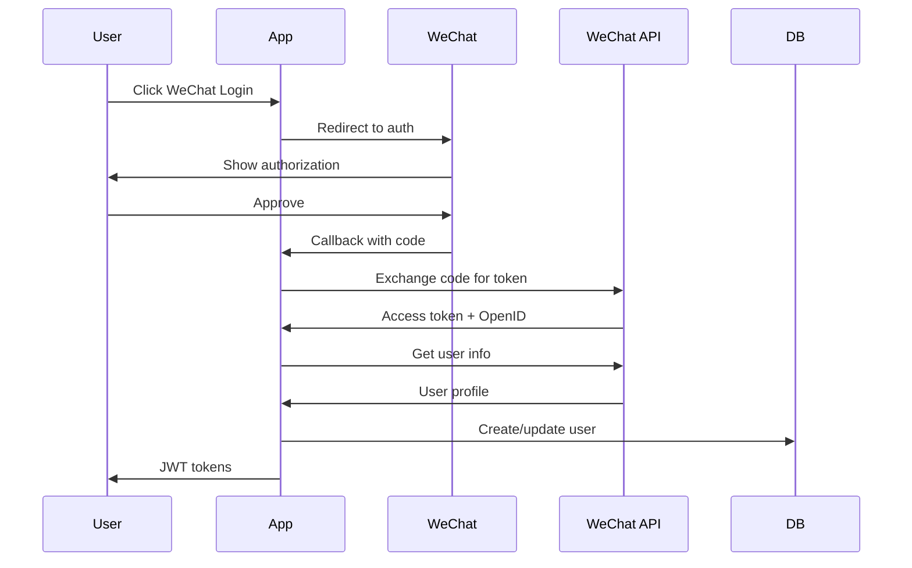

# Task: AUTH-003 - Implement WeChat OAuth Integration

## Task Information
- **Task ID**: AUTH-003
- **Title**: Implement WeChat OAuth Integration
- **Priority**: P0-Critical
- **Module/Component**: Authentication & Authorization
- **Estimated Hours**: 8-10 hours

## Description
Implement WeChat OAuth 2.0 authentication for user registration and login. This includes handling WeChat authorization codes, exchanging for access tokens, fetching user information, and creating/linking user accounts.

## Technical Requirements

### 1. WeChat OAuth Flow


### 2. Data Models
```typescript
interface WeChatAuthRequest {
  type: 'wechat';
  code: string; // WeChat authorization code
  state?: string; // CSRF protection
}

interface WeChatUserInfo {
  openid: string;
  unionid?: string;
  nickname: string;
  headimgurl: string;
  sex: number;
  province: string;
  city: string;
  country: string;
}

interface WeChatTokenResponse {
  access_token: string;
  expires_in: number;
  refresh_token: string;
  openid: string;
  scope: string;
  unionid?: string;
}
```

### 3. Configuration
```yaml
wechat:
  app_id: ${WECHAT_APP_ID}
  app_secret: ${WECHAT_APP_SECRET}
  redirect_uri: https://api.inknowing.ai/v1/auth/wechat/callback
  scope: snsapi_userinfo
  state_secret: ${WECHAT_STATE_SECRET} # For CSRF protection
```

## API Endpoints
Based on api-specification.yaml:

| Endpoint | Method | Description |
|----------|--------|-------------|
| `/auth/register` | POST | Register with WeChat code |
| `/auth/login` | POST | Login with WeChat code |
| `/auth/wechat/callback` | GET | WeChat OAuth callback handler |
| `/auth/wechat/url` | GET | Generate WeChat auth URL |

## WeChat API Integration

### Required WeChat APIs
1. **Authorization URL**
   ```
   https://open.weixin.qq.com/connect/oauth2/authorize
   ?appid=APPID
   &redirect_uri=REDIRECT_URI
   &response_type=code
   &scope=snsapi_userinfo
   &state=STATE#wechat_redirect
   ```

2. **Access Token Exchange**
   ```
   https://api.weixin.qq.com/sns/oauth2/access_token
   ?appid=APPID
   &secret=SECRET
   &code=CODE
   &grant_type=authorization_code
   ```

3. **User Info Fetch**
   ```
   https://api.weixin.qq.com/sns/userinfo
   ?access_token=ACCESS_TOKEN
   &openid=OPENID
   &lang=zh_CN
   ```

## Dependencies
- **External Services**:
  - WeChat OAuth API
  - HTTP client (axios, fetch, etc.)

- **Internal Dependencies**:
  - JWT token system (AUTH-001)
  - User service (USER-001)
  - Session management

## Database Tables Required

### wechat_auth_records
```sql
CREATE TABLE wechat_auth_records (
  id UUID PRIMARY KEY DEFAULT gen_random_uuid(),
  user_id UUID REFERENCES users(id) ON DELETE CASCADE,
  openid VARCHAR(255) NOT NULL UNIQUE,
  unionid VARCHAR(255),
  access_token TEXT,
  refresh_token TEXT,
  expires_at TIMESTAMP,
  scope VARCHAR(255),
  raw_data JSONB,
  created_at TIMESTAMP DEFAULT CURRENT_TIMESTAMP,
  updated_at TIMESTAMP DEFAULT CURRENT_TIMESTAMP,
  INDEX idx_openid (openid),
  INDEX idx_unionid (unionid),
  INDEX idx_user_id (user_id)
);
```

### oauth_states
```sql
CREATE TABLE oauth_states (
  state VARCHAR(255) PRIMARY KEY,
  redirect_uri TEXT,
  expires_at TIMESTAMP NOT NULL,
  used BOOLEAN DEFAULT FALSE,
  created_at TIMESTAMP DEFAULT CURRENT_TIMESTAMP,
  INDEX idx_expires_at (expires_at)
);
```

## Acceptance Criteria
- [ ] WeChat authorization URL is correctly generated
- [ ] Authorization code is successfully exchanged for tokens
- [ ] User information is fetched from WeChat
- [ ] New users are created with WeChat profile
- [ ] Existing users can link WeChat account
- [ ] CSRF protection via state parameter
- [ ] WeChat tokens are securely stored
- [ ] Login returns JWT tokens
- [ ] Duplicate OpenID registration is prevented

## Test Cases

### Unit Tests
1. **State Generation**
   - Generates unique state for CSRF protection
   - State expires after 10 minutes
   - Used state is rejected

2. **Token Exchange**
   - Valid code exchanges for tokens
   - Invalid code returns error
   - Expired code is rejected

3. **User Creation**
   - Creates user from WeChat info
   - Links to existing user by phone
   - Updates user info on subsequent logins

### Integration Tests
1. Complete OAuth flow: generate URL → callback → create user
2. Existing user links WeChat account
3. Login with previously registered WeChat
4. Handle WeChat API errors gracefully
5. Concurrent requests with same code

## Error Handling
| Error Case | Status Code | Response |
|------------|-------------|----------|
| Invalid code | 400 | `{error: "INVALID_CODE", message: "Invalid or expired authorization code"}` |
| WeChat API error | 502 | `{error: "WECHAT_ERROR", message: "WeChat service unavailable"}` |
| Invalid state | 400 | `{error: "INVALID_STATE", message: "Invalid or expired state parameter"}` |
| OpenID exists | 409 | `{error: "ACCOUNT_EXISTS", message: "WeChat account already registered"}` |
| Network timeout | 504 | `{error: "TIMEOUT", message: "WeChat API timeout"}` |

## Security Considerations
1. **CSRF Protection**: Use state parameter with HMAC signature
2. **Code Replay**: Ensure authorization codes are single-use
3. **Token Storage**: Encrypt WeChat tokens in database
4. **HTTPS Only**: All callbacks must use HTTPS
5. **IP Whitelist**: Restrict callback IPs if possible
6. **Rate Limiting**: Limit authorization attempts per IP

## Implementation Notes
1. Cache WeChat access tokens (2 hour expiry)
2. Implement token refresh before expiry
3. Store raw WeChat response for debugging
4. Map WeChat avatar to CDN for performance
5. Handle WeChat API maintenance windows
6. Implement retry logic with exponential backoff

## Monitoring & Alerts
- WeChat API success rate < 95%
- Authorization code exchange failures
- Unusual spike in WeChat registrations
- Token refresh failures
- API response time > 2 seconds

## Related Tasks
- AUTH-001: JWT Token Management (dependency)
- AUTH-002: Phone Authentication
- USER-001: User Model Creation
- USER-002: User Profile Management