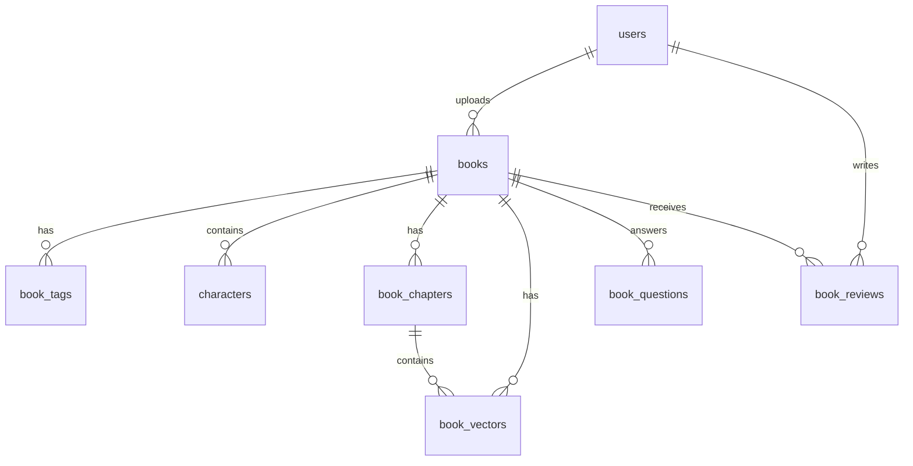

# DB-003: Book Management and Character Tables

## Task Information
- **Task ID**: DB-003
- **Title**: Create Book, Character, and Related Content Tables
- **Priority**: P0 (Critical - Core business entity)
- **Estimated Hours**: 8
- **Dependencies**: DB-001 (Database Initialization), DB-002 (User Tables)
- **Related API Specs**: /books/*, /search/*, /admin/books/*

## Database Schema Design

### 1. Books Table (content.books)

```sql
-- Main books table
CREATE TABLE content.books (
    id UUID PRIMARY KEY DEFAULT uuid_generate_v4(),
    book_id VARCHAR(50) UNIQUE NOT NULL DEFAULT generate_short_id('book'),
    title VARCHAR(500) NOT NULL,
    author VARCHAR(255) NOT NULL,
    isbn VARCHAR(20),
    cover_url VARCHAR(1000),
    category VARCHAR(50),
    description TEXT,
    type book_type NOT NULL, -- 'ai_known' or 'vectorized'
    status book_status DEFAULT 'draft',
    source VARCHAR(20) DEFAULT 'admin', -- 'admin' or 'user_upload'

    -- Statistics
    dialogue_count INTEGER DEFAULT 0,
    rating DECIMAL(2,1) DEFAULT 0.0 CHECK (rating >= 0 AND rating <= 5),
    rating_count INTEGER DEFAULT 0,
    view_count INTEGER DEFAULT 0,

    -- Metadata
    language VARCHAR(10) DEFAULT 'zh-CN',
    publish_year INTEGER,
    page_count INTEGER,
    word_count INTEGER,
    chapters INTEGER,
    estimated_reading_time INTEGER, -- in minutes

    -- Upload related (for user uploaded books)
    uploader_id UUID REFERENCES auth.users(id) ON DELETE SET NULL,
    original_filename VARCHAR(500),
    file_size INTEGER, -- in bytes

    -- AI Processing
    ai_model_tested VARCHAR(100), -- Model used for AI detection
    ai_known BOOLEAN DEFAULT false,
    vector_status processing_step_status DEFAULT 'not_needed',
    vector_count INTEGER DEFAULT 0,
    embedding_model VARCHAR(100), -- Model used for vectorization

    -- Admin fields
    review_status VARCHAR(50),
    reviewer_id UUID REFERENCES auth.users(id) ON DELETE SET NULL,
    review_notes TEXT,
    featured BOOLEAN DEFAULT false,

    -- Cost tracking
    total_api_cost DECIMAL(10,4) DEFAULT 0.00, -- in USD

    created_at TIMESTAMP DEFAULT CURRENT_TIMESTAMP,
    updated_at TIMESTAMP DEFAULT CURRENT_TIMESTAMP,
    published_at TIMESTAMP,
    deleted_at TIMESTAMP -- Soft delete
);

-- Create indexes
CREATE INDEX idx_books_title ON content.books USING GIN(to_tsvector('simple', title));
CREATE INDEX idx_books_author ON content.books USING GIN(to_tsvector('simple', author));
CREATE INDEX idx_books_category ON content.books(category) WHERE status = 'published';
CREATE INDEX idx_books_status ON content.books(status);
CREATE INDEX idx_books_type ON content.books(type);
CREATE INDEX idx_books_dialogue_count ON content.books(dialogue_count DESC) WHERE status = 'published';
CREATE INDEX idx_books_rating ON content.books(rating DESC) WHERE status = 'published' AND rating_count > 0;
CREATE INDEX idx_books_created_at ON content.books(created_at DESC);
CREATE INDEX idx_books_uploader ON content.books(uploader_id) WHERE uploader_id IS NOT NULL;

-- Add trigger for updated_at
CREATE TRIGGER update_books_updated_at BEFORE UPDATE ON content.books
    FOR EACH ROW EXECUTE FUNCTION update_updated_at_column();
```

### 2. Book Tags Table (content.book_tags)

```sql
-- Tags for categorization and search
CREATE TABLE content.book_tags (
    id UUID PRIMARY KEY DEFAULT uuid_generate_v4(),
    book_id UUID NOT NULL REFERENCES content.books(id) ON DELETE CASCADE,
    tag VARCHAR(50) NOT NULL,
    weight DECIMAL(3,2) DEFAULT 1.0, -- Tag relevance weight
    created_at TIMESTAMP DEFAULT CURRENT_TIMESTAMP,

    CONSTRAINT book_tags_unique UNIQUE(book_id, tag)
);

-- Create indexes
CREATE INDEX idx_book_tags_book_id ON content.book_tags(book_id);
CREATE INDEX idx_book_tags_tag ON content.book_tags(tag);
CREATE INDEX idx_book_tags_weighted ON content.book_tags(tag, weight DESC);
```

### 3. Characters Table (content.characters)

```sql
-- Book characters for dialogue
CREATE TABLE content.characters (
    id UUID PRIMARY KEY DEFAULT uuid_generate_v4(),
    character_id VARCHAR(50) UNIQUE NOT NULL DEFAULT generate_short_id('char'),
    book_id UUID NOT NULL REFERENCES content.books(id) ON DELETE CASCADE,
    name VARCHAR(200) NOT NULL,
    alias TEXT[], -- Alternative names
    description TEXT,
    personality TEXT,

    -- AI Configuration
    personality_prompt TEXT, -- System prompt for character
    dialogue_style JSONB DEFAULT '{}', -- {language_style, emotional_tone, knowledge_scope}
    key_memories TEXT[], -- Important character memories
    example_dialogues JSONB DEFAULT '[]', -- [{user_input, character_response}]

    -- Statistics
    dialogue_count INTEGER DEFAULT 0,
    popularity_score DECIMAL(5,2) DEFAULT 0.0,

    -- Metadata
    enabled BOOLEAN DEFAULT true,
    created_by VARCHAR(20) DEFAULT 'ai_extracted', -- 'ai_extracted' or 'admin_created'
    avatar_url VARCHAR(1000),

    created_at TIMESTAMP DEFAULT CURRENT_TIMESTAMP,
    updated_at TIMESTAMP DEFAULT CURRENT_TIMESTAMP
);

-- Create indexes
CREATE INDEX idx_characters_book_id ON content.characters(book_id);
CREATE INDEX idx_characters_name ON content.characters USING GIN(to_tsvector('simple', name));
CREATE INDEX idx_characters_enabled ON content.characters(enabled) WHERE enabled = true;
CREATE INDEX idx_characters_dialogue_count ON content.characters(dialogue_count DESC);
CREATE INDEX idx_characters_alias ON content.characters USING GIN(alias);

-- Add trigger for updated_at
CREATE TRIGGER update_characters_updated_at BEFORE UPDATE ON content.characters
    FOR EACH ROW EXECUTE FUNCTION update_updated_at_column();
```

### 4. Book Chapters Table (content.book_chapters)

```sql
-- Chapter structure for vectorized books
CREATE TABLE content.book_chapters (
    id UUID PRIMARY KEY DEFAULT uuid_generate_v4(),
    book_id UUID NOT NULL REFERENCES content.books(id) ON DELETE CASCADE,
    chapter_number INTEGER NOT NULL,
    title VARCHAR(500),
    content TEXT, -- Original text (for vectorized books)
    summary TEXT, -- AI generated summary
    word_count INTEGER,
    vector_ids UUID[], -- References to vector storage

    created_at TIMESTAMP DEFAULT CURRENT_TIMESTAMP,
    updated_at TIMESTAMP DEFAULT CURRENT_TIMESTAMP,

    CONSTRAINT book_chapters_unique UNIQUE(book_id, chapter_number)
);

-- Create indexes
CREATE INDEX idx_book_chapters_book_id ON content.book_chapters(book_id);
CREATE INDEX idx_book_chapters_number ON content.book_chapters(book_id, chapter_number);
CREATE INDEX idx_book_chapters_vector_ids ON content.book_chapters USING GIN(vector_ids);

-- Add trigger for updated_at
CREATE TRIGGER update_book_chapters_updated_at BEFORE UPDATE ON content.book_chapters
    FOR EACH ROW EXECUTE FUNCTION update_updated_at_column();
```

### 5. Book Vectors Table (content.book_vectors)

```sql
-- Vector embeddings for semantic search
CREATE TABLE content.book_vectors (
    id UUID PRIMARY KEY DEFAULT uuid_generate_v4(),
    book_id UUID NOT NULL REFERENCES content.books(id) ON DELETE CASCADE,
    chapter_id UUID REFERENCES content.book_chapters(id) ON DELETE CASCADE,
    chunk_index INTEGER NOT NULL, -- Order within chapter
    content TEXT NOT NULL, -- Text chunk
    embedding_id VARCHAR(100), -- ChromaDB reference
    metadata JSONB, -- Additional metadata for retrieval

    created_at TIMESTAMP DEFAULT CURRENT_TIMESTAMP,

    CONSTRAINT book_vectors_unique UNIQUE(book_id, chapter_id, chunk_index)
);

-- Create indexes
CREATE INDEX idx_book_vectors_book_id ON content.book_vectors(book_id);
CREATE INDEX idx_book_vectors_chapter_id ON content.book_vectors(chapter_id);
CREATE INDEX idx_book_vectors_embedding_id ON content.book_vectors(embedding_id);
```

### 6. Book Questions Table (content.book_questions)

```sql
-- Pre-indexed questions that books can answer
CREATE TABLE content.book_questions (
    id UUID PRIMARY KEY DEFAULT uuid_generate_v4(),
    book_id UUID NOT NULL REFERENCES content.books(id) ON DELETE CASCADE,
    question TEXT NOT NULL,
    relevance_score DECIMAL(5,2) DEFAULT 0.0,
    matched_chapters INTEGER[],
    answer_preview TEXT,
    ask_count INTEGER DEFAULT 0,

    created_at TIMESTAMP DEFAULT CURRENT_TIMESTAMP,
    updated_at TIMESTAMP DEFAULT CURRENT_TIMESTAMP
);

-- Create indexes
CREATE INDEX idx_book_questions_book_id ON content.book_questions(book_id);
CREATE INDEX idx_book_questions_question ON content.book_questions USING GIN(to_tsvector('simple', question));
CREATE INDEX idx_book_questions_relevance ON content.book_questions(relevance_score DESC);
CREATE INDEX idx_book_questions_ask_count ON content.book_questions(ask_count DESC);

-- Add trigger for updated_at
CREATE TRIGGER update_book_questions_updated_at BEFORE UPDATE ON content.book_questions
    FOR EACH ROW EXECUTE FUNCTION update_updated_at_column();
```

### 7. Popular Books Table (content.popular_books)

```sql
-- Materialized view for popular books (refreshed periodically)
CREATE MATERIALIZED VIEW content.popular_books AS
SELECT
    b.id,
    b.book_id,
    b.title,
    b.author,
    b.cover_url,
    b.category,
    b.description,
    b.dialogue_count,
    b.rating,
    b.rating_count,
    -- Popularity score calculation
    (b.dialogue_count * 0.4 +
     b.view_count * 0.2 +
     b.rating * b.rating_count * 0.3 +
     EXTRACT(EPOCH FROM (CURRENT_TIMESTAMP - b.created_at)) / -86400 * 0.1) AS popularity_score,
    -- Period-based counts
    COUNT(DISTINCT d.user_id) FILTER (WHERE d.created_at > CURRENT_DATE) AS today_dialogues,
    COUNT(DISTINCT d.user_id) FILTER (WHERE d.created_at > CURRENT_DATE - INTERVAL '7 days') AS week_dialogues,
    COUNT(DISTINCT d.user_id) FILTER (WHERE d.created_at > CURRENT_DATE - INTERVAL '30 days') AS month_dialogues
FROM content.books b
LEFT JOIN dialogue.dialogue_sessions d ON b.id = d.book_id
WHERE b.status = 'published'
GROUP BY b.id;

-- Create indexes on materialized view
CREATE UNIQUE INDEX idx_popular_books_id ON content.popular_books(id);
CREATE INDEX idx_popular_books_score ON content.popular_books(popularity_score DESC);
CREATE INDEX idx_popular_books_today ON content.popular_books(today_dialogues DESC);
CREATE INDEX idx_popular_books_week ON content.popular_books(week_dialogues DESC);
CREATE INDEX idx_popular_books_month ON content.popular_books(month_dialogues DESC);
```

### 8. Book Reviews Table (content.book_reviews)

```sql
-- User reviews and ratings
CREATE TABLE content.book_reviews (
    id UUID PRIMARY KEY DEFAULT uuid_generate_v4(),
    book_id UUID NOT NULL REFERENCES content.books(id) ON DELETE CASCADE,
    user_id UUID NOT NULL REFERENCES auth.users(id) ON DELETE CASCADE,
    rating INTEGER NOT NULL CHECK (rating >= 1 AND rating <= 5),
    review TEXT,
    helpful_count INTEGER DEFAULT 0,
    verified_purchase BOOLEAN DEFAULT false, -- Has had dialogue with book

    created_at TIMESTAMP DEFAULT CURRENT_TIMESTAMP,
    updated_at TIMESTAMP DEFAULT CURRENT_TIMESTAMP,

    CONSTRAINT book_reviews_unique UNIQUE(book_id, user_id)
);

-- Create indexes
CREATE INDEX idx_book_reviews_book_id ON content.book_reviews(book_id);
CREATE INDEX idx_book_reviews_user_id ON content.book_reviews(user_id);
CREATE INDEX idx_book_reviews_rating ON content.book_reviews(rating);
CREATE INDEX idx_book_reviews_created_at ON content.book_reviews(created_at DESC);

-- Add trigger for updated_at
CREATE TRIGGER update_book_reviews_updated_at BEFORE UPDATE ON content.book_reviews
    FOR EACH ROW EXECUTE FUNCTION update_updated_at_column();

-- Trigger to update book rating
CREATE OR REPLACE FUNCTION update_book_rating()
RETURNS TRIGGER AS $$
BEGIN
    UPDATE content.books
    SET rating = (
        SELECT AVG(rating)::DECIMAL(2,1)
        FROM content.book_reviews
        WHERE book_id = NEW.book_id
    ),
    rating_count = (
        SELECT COUNT(*)
        FROM content.book_reviews
        WHERE book_id = NEW.book_id
    )
    WHERE id = NEW.book_id;
    RETURN NEW;
END;
$$ LANGUAGE plpgsql;

CREATE TRIGGER update_book_rating_trigger
AFTER INSERT OR UPDATE OR DELETE ON content.book_reviews
FOR EACH ROW EXECUTE FUNCTION update_book_rating();
```

## Table Relationships



## Index Strategy

### Primary Indexes
- UUID primary keys with automatic B-tree indexes
- Unique constraints on business identifiers (book_id, character_id)

### Secondary Indexes
- Full-text search indexes on title, author, description
- Category and status for filtering
- Dialogue count and rating for sorting
- GIN indexes for array and JSONB fields

### Performance Indexes
- Partial indexes on published books only
- Composite indexes for common query patterns

## Performance Optimization

### Query Optimization
```sql
-- Common query: Search books by question
EXPLAIN ANALYZE
SELECT DISTINCT b.*, bq.relevance_score
FROM content.books b
JOIN content.book_questions bq ON b.id = bq.book_id
WHERE to_tsvector('simple', bq.question) @@ plainto_tsquery('simple', 'team motivation')
  AND b.status = 'published'
ORDER BY bq.relevance_score DESC
LIMIT 10;

-- Common query: Get popular books
EXPLAIN ANALYZE
SELECT * FROM content.popular_books
WHERE month_dialogues > 0
ORDER BY popularity_score DESC
LIMIT 20;
```

### Materialized View Refresh
```sql
-- Refresh popular books every hour
CREATE OR REPLACE FUNCTION refresh_popular_books()
RETURNS void AS $$
BEGIN
    REFRESH MATERIALIZED VIEW CONCURRENTLY content.popular_books;
END;
$$ LANGUAGE plpgsql;

-- Schedule with pg_cron
SELECT cron.schedule('refresh-popular-books', '0 * * * *', 'SELECT refresh_popular_books();');
```

## Migration Scripts

### Create Tables
```bash
#!/bin/bash
# create_book_tables.sh

psql -d inknowing_db << EOF
\i 003_01_create_books_table.sql
\i 003_02_create_book_tags_table.sql
\i 003_03_create_characters_table.sql
\i 003_04_create_book_chapters_table.sql
\i 003_05_create_book_vectors_table.sql
\i 003_06_create_book_questions_table.sql
\i 003_07_create_popular_books_view.sql
\i 003_08_create_book_reviews_table.sql
\i 003_09_create_book_functions.sql
EOF
```

### Rollback Strategy
```sql
-- rollback_book_tables.sql
DROP MATERIALIZED VIEW IF EXISTS content.popular_books CASCADE;
DROP TABLE IF EXISTS content.book_reviews CASCADE;
DROP TABLE IF EXISTS content.book_questions CASCADE;
DROP TABLE IF EXISTS content.book_vectors CASCADE;
DROP TABLE IF EXISTS content.book_chapters CASCADE;
DROP TABLE IF EXISTS content.characters CASCADE;
DROP TABLE IF EXISTS content.book_tags CASCADE;
DROP TABLE IF EXISTS content.books CASCADE;

DROP FUNCTION IF EXISTS update_book_rating() CASCADE;
DROP FUNCTION IF EXISTS refresh_popular_books() CASCADE;
```

## Test Cases

### 1. Book Creation Test
```sql
-- Create AI-known book
INSERT INTO content.books (title, author, type, status, ai_known)
VALUES ('思考，快与慢', '丹尼尔·卡尼曼', 'ai_known', 'published', true);

-- Create user-uploaded book
INSERT INTO content.books (title, author, type, status, uploader_id, vector_status)
VALUES ('掌控习惯', '詹姆斯·克利尔', 'vectorized', 'review',
        (SELECT id FROM auth.users LIMIT 1), 'processing');

-- Verify creation
SELECT book_id, title, type, status FROM content.books;
```

### 2. Character Management Test
```sql
-- Add characters to book
INSERT INTO content.characters (book_id, name, description, personality_prompt)
SELECT id, '系统1', '快速直觉思维系统', '你是人类的快速思维系统...'
FROM content.books WHERE title = '思考，快与慢';

-- Test character search
SELECT * FROM content.characters
WHERE book_id IN (SELECT id FROM content.books WHERE title = '思考，快与慢');
```

### 3. Search Performance Test
```sql
-- Insert test data
INSERT INTO content.books (title, author, type, status)
SELECT
    'Book ' || i,
    'Author ' || (i % 100),
    CASE WHEN i % 2 = 0 THEN 'ai_known' ELSE 'vectorized' END,
    'published'
FROM generate_series(1, 10000) i;

-- Test search performance
EXPLAIN ANALYZE
SELECT * FROM content.books
WHERE to_tsvector('simple', title || ' ' || author) @@ plainto_tsquery('simple', 'Book 500');
-- Expected: < 10ms with GIN index
```

### 4. Popular Books Test
```sql
-- Refresh materialized view
REFRESH MATERIALIZED VIEW content.popular_books;

-- Query popular books
SELECT title, popularity_score, week_dialogues
FROM content.popular_books
ORDER BY popularity_score DESC
LIMIT 10;
```

### 5. Review System Test
```sql
-- Add reviews
INSERT INTO content.book_reviews (book_id, user_id, rating, review)
SELECT
    (SELECT id FROM content.books LIMIT 1),
    (SELECT id FROM auth.users LIMIT 1),
    4,
    'Great book!';

-- Check rating update
SELECT title, rating, rating_count
FROM content.books
WHERE rating_count > 0;
```

## Success Criteria
- [ ] All tables created successfully
- [ ] Indexes properly configured
- [ ] Full-text search working
- [ ] Materialized view refreshing
- [ ] Rating system functioning
- [ ] Performance benchmarks met (< 20ms for search queries)
- [ ] All test cases passing

## Notes
- ChromaDB integration for vector storage handled separately
- Book cover images stored as URLs (CDN recommended)
- Consider implementing book recommendation engine
- PDF/TXT parsing handled at application level
- Character avatars can be AI-generated or uploaded