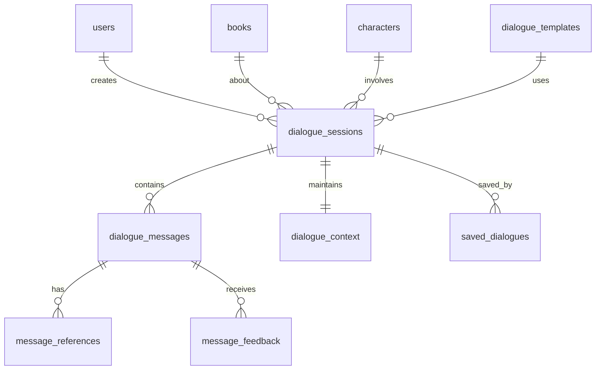

# DB-004: Dialogue Sessions and Message Tables

## Task Information
- **Task ID**: DB-004
- **Title**: Create Dialogue, Message, and Context Management Tables
- **Priority**: P0 (Critical - Core feature)
- **Estimated Hours**: 10
- **Dependencies**: DB-001, DB-002 (Users), DB-003 (Books)
- **Related API Specs**: /dialogues/*, Real-time chat functionality

## Database Schema Design

### 1. Dialogue Sessions Table (dialogue.dialogue_sessions)

```sql
-- Main dialogue sessions table
CREATE TABLE dialogue.dialogue_sessions (
    id UUID PRIMARY KEY DEFAULT uuid_generate_v4(),
    session_id VARCHAR(50) UNIQUE NOT NULL DEFAULT generate_short_id('dlg'),
    user_id UUID NOT NULL REFERENCES auth.users(id) ON DELETE CASCADE,
    book_id UUID NOT NULL REFERENCES content.books(id) ON DELETE CASCADE,
    type dialogue_type NOT NULL, -- 'book' or 'character'
    character_id UUID REFERENCES content.characters(id) ON DELETE SET NULL,

    -- Session metadata
    title VARCHAR(500), -- Auto-generated or user-defined
    initial_question TEXT, -- First question/message
    status dialogue_status DEFAULT 'active',
    message_count INTEGER DEFAULT 0,

    -- Context management
    context_window INTEGER DEFAULT 4000, -- Token limit for context
    system_prompt TEXT, -- Customized system prompt
    temperature DECIMAL(2,1) DEFAULT 0.7,
    model_name VARCHAR(100), -- Model used for this session

    -- Statistics
    total_tokens_used INTEGER DEFAULT 0,
    total_cost DECIMAL(10,4) DEFAULT 0.0000, -- in USD
    user_rating INTEGER CHECK (user_rating >= 1 AND user_rating <= 5),

    -- Timestamps
    last_message_at TIMESTAMP,
    ended_at TIMESTAMP,
    created_at TIMESTAMP DEFAULT CURRENT_TIMESTAMP,
    updated_at TIMESTAMP DEFAULT CURRENT_TIMESTAMP
);

-- Create indexes
CREATE INDEX idx_dialogue_sessions_user_id ON dialogue.dialogue_sessions(user_id);
CREATE INDEX idx_dialogue_sessions_book_id ON dialogue.dialogue_sessions(book_id);
CREATE INDEX idx_dialogue_sessions_character_id ON dialogue.dialogue_sessions(character_id) WHERE character_id IS NOT NULL;
CREATE INDEX idx_dialogue_sessions_status ON dialogue.dialogue_sessions(status);
CREATE INDEX idx_dialogue_sessions_type ON dialogue.dialogue_sessions(type);
CREATE INDEX idx_dialogue_sessions_created_at ON dialogue.dialogue_sessions(created_at DESC);
CREATE INDEX idx_dialogue_sessions_last_message ON dialogue.dialogue_sessions(last_message_at DESC);

-- Add trigger for updated_at
CREATE TRIGGER update_dialogue_sessions_updated_at BEFORE UPDATE ON dialogue.dialogue_sessions
    FOR EACH ROW EXECUTE FUNCTION update_updated_at_column();
```

### 2. Dialogue Messages Table (dialogue.dialogue_messages)

```sql
-- Messages within dialogue sessions (partitioned by month)
CREATE TABLE dialogue.dialogue_messages (
    id UUID DEFAULT uuid_generate_v4(),
    session_id UUID NOT NULL,
    message_id VARCHAR(50) NOT NULL DEFAULT generate_short_id('msg'),
    role message_role NOT NULL, -- 'user', 'assistant', 'system'
    content TEXT NOT NULL,

    -- Token tracking
    tokens_used INTEGER,
    model_used VARCHAR(100),

    -- Response metadata
    response_time_ms INTEGER, -- Time to generate response
    confidence_score DECIMAL(3,2), -- AI confidence in response

    -- Error handling
    error_code VARCHAR(50),
    error_message TEXT,
    retry_count INTEGER DEFAULT 0,

    created_at TIMESTAMP DEFAULT CURRENT_TIMESTAMP,

    PRIMARY KEY (id, created_at)
) PARTITION BY RANGE (created_at);

-- Create foreign key separately (partitioned tables limitation)
ALTER TABLE dialogue.dialogue_messages
    ADD CONSTRAINT fk_dialogue_messages_session
    FOREIGN KEY (session_id) REFERENCES dialogue.dialogue_sessions(id) ON DELETE CASCADE;

-- Create partitions for the next 12 months
DO $$
DECLARE
    start_date date := DATE_TRUNC('month', CURRENT_DATE);
    end_date date;
    partition_name text;
BEGIN
    FOR i IN 0..11 LOOP
        end_date := start_date + INTERVAL '1 month';
        partition_name := 'dialogue_messages_' || TO_CHAR(start_date, 'YYYY_MM');

        EXECUTE format('
            CREATE TABLE IF NOT EXISTS dialogue.%I PARTITION OF dialogue.dialogue_messages
            FOR VALUES FROM (%L) TO (%L)',
            partition_name, start_date, end_date
        );

        -- Create indexes on partition
        EXECUTE format('
            CREATE INDEX IF NOT EXISTS idx_%I_session_id ON dialogue.%I(session_id);
            CREATE INDEX IF NOT EXISTS idx_%I_created_at ON dialogue.%I(created_at DESC);
            CREATE INDEX IF NOT EXISTS idx_%I_role ON dialogue.%I(role);',
            partition_name, partition_name,
            partition_name, partition_name,
            partition_name, partition_name
        );

        start_date := end_date;
    END LOOP;
END $$;
```

### 3. Message References Table (dialogue.message_references)

```sql
-- References/citations in messages
CREATE TABLE dialogue.message_references (
    id UUID PRIMARY KEY DEFAULT uuid_generate_v4(),
    message_id UUID NOT NULL,
    reference_type VARCHAR(50) NOT NULL, -- 'chapter', 'page', 'paragraph', 'character_memory'
    chapter_number INTEGER,
    page_number INTEGER,
    paragraph_index INTEGER,

    -- Reference content
    source_text TEXT, -- Original text being referenced
    highlighted_text TEXT, -- Specific portion highlighted

    -- Vector search related
    vector_id VARCHAR(100), -- ChromaDB vector ID
    similarity_score DECIMAL(3,2), -- Relevance score

    created_at TIMESTAMP DEFAULT CURRENT_TIMESTAMP
);

-- Create indexes
CREATE INDEX idx_message_references_message_id ON dialogue.message_references(message_id);
CREATE INDEX idx_message_references_type ON dialogue.message_references(reference_type);
CREATE INDEX idx_message_references_vector_id ON dialogue.message_references(vector_id);
```

### 4. Dialogue Context Table (dialogue.dialogue_context)

```sql
-- Managed context for ongoing dialogues
CREATE TABLE dialogue.dialogue_context (
    session_id UUID PRIMARY KEY REFERENCES dialogue.dialogue_sessions(id) ON DELETE CASCADE,

    -- Book context
    current_chapter INTEGER,
    discussed_chapters INTEGER[],
    discussed_topics TEXT[],
    key_points TEXT[], -- Important points from conversation

    -- Character context (for character dialogues)
    character_state VARCHAR(100), -- Current emotional/mental state
    emotional_tone VARCHAR(50),
    remembered_facts JSONB DEFAULT '[]', -- Facts character "remembers" about user
    relationship_level INTEGER DEFAULT 0, -- Familiarity with user

    -- Context window management
    context_messages JSONB DEFAULT '[]', -- Recent messages for context
    context_tokens INTEGER DEFAULT 0,

    -- Search optimization
    embedded_context TEXT, -- Concatenated context for vector search

    created_at TIMESTAMP DEFAULT CURRENT_TIMESTAMP,
    updated_at TIMESTAMP DEFAULT CURRENT_TIMESTAMP
);

-- Create indexes
CREATE INDEX idx_dialogue_context_topics ON dialogue.dialogue_context USING GIN(discussed_topics);
CREATE INDEX idx_dialogue_context_chapters ON dialogue.dialogue_context USING GIN(discussed_chapters);

-- Add trigger for updated_at
CREATE TRIGGER update_dialogue_context_updated_at BEFORE UPDATE ON dialogue.dialogue_context
    FOR EACH ROW EXECUTE FUNCTION update_updated_at_column();
```

### 5. Saved Dialogues Table (dialogue.saved_dialogues)

```sql
-- User's saved/bookmarked dialogues
CREATE TABLE dialogue.saved_dialogues (
    id UUID PRIMARY KEY DEFAULT uuid_generate_v4(),
    user_id UUID NOT NULL REFERENCES auth.users(id) ON DELETE CASCADE,
    session_id UUID NOT NULL REFERENCES dialogue.dialogue_sessions(id) ON DELETE CASCADE,
    title VARCHAR(500), -- User-defined title
    notes TEXT, -- User's notes
    tags TEXT[],
    is_public BOOLEAN DEFAULT false, -- Share with community

    created_at TIMESTAMP DEFAULT CURRENT_TIMESTAMP,
    updated_at TIMESTAMP DEFAULT CURRENT_TIMESTAMP,

    CONSTRAINT saved_dialogues_unique UNIQUE(user_id, session_id)
);

-- Create indexes
CREATE INDEX idx_saved_dialogues_user_id ON dialogue.saved_dialogues(user_id);
CREATE INDEX idx_saved_dialogues_session_id ON dialogue.saved_dialogues(session_id);
CREATE INDEX idx_saved_dialogues_tags ON dialogue.saved_dialogues USING GIN(tags);
CREATE INDEX idx_saved_dialogues_public ON dialogue.saved_dialogues(is_public) WHERE is_public = true;

-- Add trigger for updated_at
CREATE TRIGGER update_saved_dialogues_updated_at BEFORE UPDATE ON dialogue.saved_dialogues
    FOR EACH ROW EXECUTE FUNCTION update_updated_at_column();
```

### 6. Dialogue Templates Table (dialogue.dialogue_templates)

```sql
-- Pre-configured dialogue templates
CREATE TABLE dialogue.dialogue_templates (
    id UUID PRIMARY KEY DEFAULT uuid_generate_v4(),
    name VARCHAR(200) NOT NULL,
    description TEXT,
    type dialogue_type NOT NULL,
    category VARCHAR(50),

    -- Template configuration
    system_prompt TEXT NOT NULL,
    initial_messages JSONB DEFAULT '[]', -- Starter messages
    suggested_questions TEXT[],
    temperature DECIMAL(2,1) DEFAULT 0.7,
    model_preference VARCHAR(100),

    -- Usage tracking
    usage_count INTEGER DEFAULT 0,
    rating DECIMAL(2,1) DEFAULT 0.0,

    -- Metadata
    is_active BOOLEAN DEFAULT true,
    created_by UUID REFERENCES auth.users(id) ON DELETE SET NULL,

    created_at TIMESTAMP DEFAULT CURRENT_TIMESTAMP,
    updated_at TIMESTAMP DEFAULT CURRENT_TIMESTAMP
);

-- Create indexes
CREATE INDEX idx_dialogue_templates_type ON dialogue.dialogue_templates(type);
CREATE INDEX idx_dialogue_templates_category ON dialogue.dialogue_templates(category);
CREATE INDEX idx_dialogue_templates_active ON dialogue.dialogue_templates(is_active) WHERE is_active = true;
CREATE INDEX idx_dialogue_templates_usage ON dialogue.dialogue_templates(usage_count DESC);

-- Add trigger for updated_at
CREATE TRIGGER update_dialogue_templates_updated_at BEFORE UPDATE ON dialogue.dialogue_templates
    FOR EACH ROW EXECUTE FUNCTION update_updated_at_column();
```

### 7. Message Feedback Table (dialogue.message_feedback)

```sql
-- User feedback on AI responses
CREATE TABLE dialogue.message_feedback (
    id UUID PRIMARY KEY DEFAULT uuid_generate_v4(),
    message_id UUID NOT NULL,
    user_id UUID NOT NULL REFERENCES auth.users(id) ON DELETE CASCADE,
    feedback_type VARCHAR(20) NOT NULL, -- 'helpful', 'unhelpful', 'incorrect'
    feedback_text TEXT,

    created_at TIMESTAMP DEFAULT CURRENT_TIMESTAMP,

    CONSTRAINT message_feedback_unique UNIQUE(message_id, user_id)
);

-- Create indexes
CREATE INDEX idx_message_feedback_message_id ON dialogue.message_feedback(message_id);
CREATE INDEX idx_message_feedback_user_id ON dialogue.message_feedback(user_id);
CREATE INDEX idx_message_feedback_type ON dialogue.message_feedback(feedback_type);
```

### 8. Dialogue Analytics Table (dialogue.dialogue_analytics)

```sql
-- Aggregated analytics for dialogues (materialized view)
CREATE MATERIALIZED VIEW dialogue.dialogue_analytics AS
SELECT
    ds.book_id,
    ds.character_id,
    ds.type,
    DATE(ds.created_at) as date,
    COUNT(DISTINCT ds.id) as session_count,
    COUNT(DISTINCT ds.user_id) as unique_users,
    AVG(ds.message_count)::DECIMAL(5,2) as avg_messages_per_session,
    AVG(ds.total_tokens_used)::DECIMAL(8,2) as avg_tokens_per_session,
    SUM(ds.total_cost)::DECIMAL(10,4) as total_cost,
    AVG(ds.user_rating)::DECIMAL(2,1) as avg_rating,
    COUNT(CASE WHEN ds.status = 'ended' THEN 1 END) as completed_sessions,
    AVG(EXTRACT(EPOCH FROM (ds.ended_at - ds.created_at))/60)::DECIMAL(8,2) as avg_session_duration_minutes
FROM dialogue.dialogue_sessions ds
GROUP BY ds.book_id, ds.character_id, ds.type, DATE(ds.created_at);

-- Create indexes
CREATE INDEX idx_dialogue_analytics_book_id ON dialogue.dialogue_analytics(book_id);
CREATE INDEX idx_dialogue_analytics_character_id ON dialogue.dialogue_analytics(character_id);
CREATE INDEX idx_dialogue_analytics_date ON dialogue.dialogue_analytics(date DESC);
CREATE INDEX idx_dialogue_analytics_type ON dialogue.dialogue_analytics(type);
```

## Table Relationships



## Performance Optimization

### Partitioning Strategy
```sql
-- Auto-create monthly partitions
CREATE OR REPLACE FUNCTION create_monthly_partition()
RETURNS void AS $$
DECLARE
    partition_date date;
    partition_name text;
BEGIN
    partition_date := DATE_TRUNC('month', CURRENT_DATE + INTERVAL '1 month');
    partition_name := 'dialogue_messages_' || TO_CHAR(partition_date, 'YYYY_MM');

    -- Check if partition exists
    IF NOT EXISTS (
        SELECT 1 FROM pg_tables
        WHERE schemaname = 'dialogue'
        AND tablename = partition_name
    ) THEN
        EXECUTE format('
            CREATE TABLE dialogue.%I PARTITION OF dialogue.dialogue_messages
            FOR VALUES FROM (%L) TO (%L)',
            partition_name,
            partition_date,
            partition_date + INTERVAL '1 month'
        );

        -- Create indexes
        EXECUTE format('
            CREATE INDEX idx_%I_session_id ON dialogue.%I(session_id);
            CREATE INDEX idx_%I_created_at ON dialogue.%I(created_at DESC);',
            partition_name, partition_name,
            partition_name, partition_name
        );
    END IF;
END;
$$ LANGUAGE plpgsql;

-- Schedule with pg_cron to run monthly
SELECT cron.schedule('create-partition', '0 0 1 * *', 'SELECT create_monthly_partition();');
```

### Query Optimization
```sql
-- Common query: Get dialogue history with pagination
EXPLAIN ANALYZE
SELECT dm.*, dr.source_text, dr.highlighted_text
FROM dialogue.dialogue_messages dm
LEFT JOIN dialogue.message_references dr ON dm.id = dr.message_id
WHERE dm.session_id = 'session_uuid'
ORDER BY dm.created_at DESC
LIMIT 20 OFFSET 0;

-- Common query: Get active sessions for user
EXPLAIN ANALYZE
SELECT ds.*, b.title, b.author, c.name as character_name
FROM dialogue.dialogue_sessions ds
JOIN content.books b ON ds.book_id = b.id
LEFT JOIN content.characters c ON ds.character_id = c.id
WHERE ds.user_id = 'user_uuid' AND ds.status = 'active'
ORDER BY ds.last_message_at DESC;
```

### Caching Strategy
- Active session contexts cached in Redis
- Recent messages cached with 10-minute TTL
- Popular dialogue templates cached for 1 hour

## Migration Scripts

### Create Tables
```bash
#!/bin/bash
# create_dialogue_tables.sh

psql -d inknowing_db << EOF
\i 004_01_create_dialogue_sessions_table.sql
\i 004_02_create_dialogue_messages_table.sql
\i 004_03_create_message_references_table.sql
\i 004_04_create_dialogue_context_table.sql
\i 004_05_create_saved_dialogues_table.sql
\i 004_06_create_dialogue_templates_table.sql
\i 004_07_create_message_feedback_table.sql
\i 004_08_create_dialogue_analytics_view.sql
\i 004_09_create_partition_functions.sql
EOF
```

### Rollback Strategy
```sql
-- rollback_dialogue_tables.sql
DROP MATERIALIZED VIEW IF EXISTS dialogue.dialogue_analytics CASCADE;
DROP TABLE IF EXISTS dialogue.message_feedback CASCADE;
DROP TABLE IF EXISTS dialogue.dialogue_templates CASCADE;
DROP TABLE IF EXISTS dialogue.saved_dialogues CASCADE;
DROP TABLE IF EXISTS dialogue.dialogue_context CASCADE;
DROP TABLE IF EXISTS dialogue.message_references CASCADE;
DROP TABLE IF EXISTS dialogue.dialogue_messages CASCADE;
DROP TABLE IF EXISTS dialogue.dialogue_sessions CASCADE;

DROP FUNCTION IF EXISTS create_monthly_partition() CASCADE;
```

## Test Cases

### 1. Session Creation Test
```sql
-- Create dialogue session
INSERT INTO dialogue.dialogue_sessions (user_id, book_id, type, initial_question)
SELECT
    (SELECT id FROM auth.users LIMIT 1),
    (SELECT id FROM content.books LIMIT 1),
    'book',
    'What is the main theme of this book?'
RETURNING session_id;

-- Create character dialogue
INSERT INTO dialogue.dialogue_sessions (user_id, book_id, character_id, type)
SELECT
    u.id,
    b.id,
    c.id,
    'character'
FROM auth.users u, content.books b, content.characters c
WHERE c.book_id = b.id
LIMIT 1;
```

### 2. Message Flow Test
```sql
-- Add messages to session
WITH session AS (
    SELECT id FROM dialogue.dialogue_sessions LIMIT 1
)
INSERT INTO dialogue.dialogue_messages (session_id, role, content, tokens_used)
SELECT
    s.id,
    'user',
    'Tell me about the main character',
    50
FROM session s;

-- Add AI response
WITH session AS (
    SELECT id FROM dialogue.dialogue_sessions LIMIT 1
)
INSERT INTO dialogue.dialogue_messages (session_id, role, content, tokens_used, model_used)
SELECT
    s.id,
    'assistant',
    'The main character is...',
    150,
    'gpt-4'
FROM session s;

-- Add references
INSERT INTO dialogue.message_references (message_id, reference_type, chapter_number, source_text)
SELECT
    dm.id,
    'chapter',
    3,
    'Chapter 3 introduces the protagonist...'
FROM dialogue.dialogue_messages dm
WHERE dm.role = 'assistant'
LIMIT 1;
```

### 3. Context Management Test
```sql
-- Initialize context
INSERT INTO dialogue.dialogue_context (session_id, discussed_topics, current_chapter)
SELECT
    id,
    ARRAY['main character', 'plot'],
    1
FROM dialogue.dialogue_sessions
LIMIT 1;

-- Update context
UPDATE dialogue.dialogue_context
SET
    discussed_chapters = array_append(discussed_chapters, 2),
    context_tokens = context_tokens + 100
WHERE session_id = (SELECT id FROM dialogue.dialogue_sessions LIMIT 1);
```

### 4. Performance Test
```sql
-- Bulk insert test messages
INSERT INTO dialogue.dialogue_messages (session_id, role, content, created_at)
SELECT
    (SELECT id FROM dialogue.dialogue_sessions LIMIT 1),
    CASE WHEN i % 2 = 0 THEN 'user' ELSE 'assistant' END,
    'Test message ' || i,
    CURRENT_TIMESTAMP - (i || ' minutes')::INTERVAL
FROM generate_series(1, 1000) i;

-- Query performance test
EXPLAIN ANALYZE
SELECT * FROM dialogue.dialogue_messages
WHERE session_id = (SELECT id FROM dialogue.dialogue_sessions LIMIT 1)
  AND created_at > CURRENT_DATE - INTERVAL '7 days'
ORDER BY created_at DESC
LIMIT 50;
-- Expected: < 5ms with partitioning
```

### 5. Analytics Test
```sql
-- Refresh analytics view
REFRESH MATERIALIZED VIEW dialogue.dialogue_analytics;

-- Query analytics
SELECT
    date,
    session_count,
    unique_users,
    avg_messages_per_session,
    total_cost
FROM dialogue.dialogue_analytics
WHERE date >= CURRENT_DATE - INTERVAL '7 days'
ORDER BY date DESC;
```

## Success Criteria
- [ ] All tables created successfully
- [ ] Partitioning working correctly
- [ ] Monthly partition auto-creation scheduled
- [ ] Indexes optimized for query patterns
- [ ] Foreign key constraints enforced
- [ ] Analytics view refreshing properly
- [ ] Performance benchmarks met (< 10ms for message queries)
- [ ] All test cases passing

## Notes
- Consider implementing real-time updates with PostgreSQL LISTEN/NOTIFY
- Message streaming handled at application level with WebSockets
- Context window management crucial for cost control
- ChromaDB vector references stored but queries handled externally
- Consider implementing dialogue summarization for long sessions