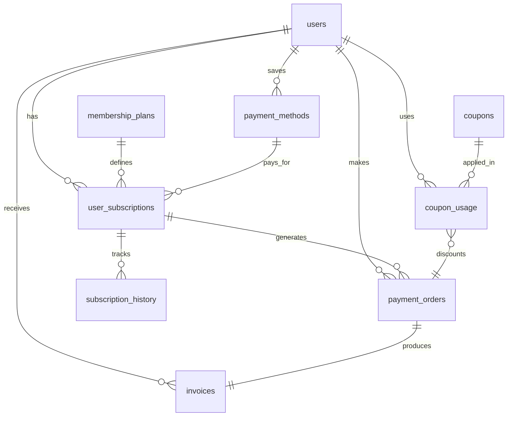

# DB-006: Payment and Membership Management Tables

## Task Information
- **Task ID**: DB-006
- **Title**: Create Payment, Subscription, and Membership Tables
- **Priority**: P1 (High - Revenue critical)
- **Estimated Hours**: 8
- **Dependencies**: DB-001, DB-002 (Users)
- **Related API Specs**: /users/membership/*, /payment/*, Admin billing management

## Database Schema Design

### 1. Membership Plans Table (payment.membership_plans)

```sql
-- Define available membership plans
CREATE TABLE payment.membership_plans (
    id UUID PRIMARY KEY DEFAULT uuid_generate_v4(),
    plan_code VARCHAR(20) UNIQUE NOT NULL, -- 'basic', 'premium', 'super'
    plan_name VARCHAR(100) NOT NULL,
    description TEXT,
    membership_type membership_type NOT NULL,

    -- Pricing (in cents to avoid floating point issues)
    price_monthly INTEGER NOT NULL,
    price_quarterly INTEGER,
    price_semi_annual INTEGER,
    price_annual INTEGER,
    currency VARCHAR(3) DEFAULT 'CNY',

    -- Benefits
    monthly_quota INTEGER NOT NULL, -- Dialogue quota
    max_uploads INTEGER DEFAULT 0, -- Max book uploads per month
    model_tier VARCHAR(50), -- 'standard', 'advanced', 'premium'
    priority_support BOOLEAN DEFAULT false,
    ad_free BOOLEAN DEFAULT false,

    -- Features JSON for flexibility
    features JSONB DEFAULT '{}', -- {feature_name: enabled}
    benefits_list TEXT[], -- Display benefits

    -- Status
    is_active BOOLEAN DEFAULT true,
    available_for_purchase BOOLEAN DEFAULT true,
    display_order INTEGER DEFAULT 0,

    created_at TIMESTAMP DEFAULT CURRENT_TIMESTAMP,
    updated_at TIMESTAMP DEFAULT CURRENT_TIMESTAMP
);

-- Create indexes
CREATE INDEX idx_membership_plans_type ON payment.membership_plans(membership_type);
CREATE INDEX idx_membership_plans_active ON payment.membership_plans(is_active) WHERE is_active = true;

-- Add trigger for updated_at
CREATE TRIGGER update_membership_plans_updated_at BEFORE UPDATE ON payment.membership_plans
    FOR EACH ROW EXECUTE FUNCTION update_updated_at_column();

-- Insert default plans
INSERT INTO payment.membership_plans (plan_code, plan_name, membership_type, price_monthly, monthly_quota, model_tier, benefits_list) VALUES
('free', '免费用户', 'free', 0, 20, 'standard', ARRAY['每天20次对话', '基础AI模型']),
('basic', '基础会员', 'basic', 4900, 200, 'standard', ARRAY['每月200次对话', '优先响应', '无广告体验']),
('premium', '高级会员', 'premium', 9900, 500, 'advanced', ARRAY['每月500次对话', '高级AI模型', '书籍5折优惠', '每月5本上传额度']),
('super', '超级会员', 'super', 19900, 1000, 'premium', ARRAY['每月1000次对话', '最强AI模型', '免费书籍', '无限上传', '专属客服']);
```

### 2. User Subscriptions Table (payment.user_subscriptions)

```sql
-- Active user subscriptions
CREATE TABLE payment.user_subscriptions (
    id UUID PRIMARY KEY DEFAULT uuid_generate_v4(),
    subscription_id VARCHAR(50) UNIQUE NOT NULL DEFAULT generate_short_id('sub'),
    user_id UUID NOT NULL REFERENCES auth.users(id) ON DELETE CASCADE,
    plan_id UUID NOT NULL REFERENCES payment.membership_plans(id),

    -- Subscription details
    status VARCHAR(20) NOT NULL DEFAULT 'active' CHECK (status IN ('pending', 'active', 'paused', 'cancelled', 'expired')),
    billing_cycle VARCHAR(20) NOT NULL CHECK (billing_cycle IN ('monthly', 'quarterly', 'semi_annual', 'annual')),

    -- Pricing at time of subscription (for history)
    price_amount INTEGER NOT NULL, -- in cents
    currency VARCHAR(3) DEFAULT 'CNY',
    discount_amount INTEGER DEFAULT 0,
    final_amount INTEGER NOT NULL,

    -- Dates
    start_date TIMESTAMP NOT NULL DEFAULT CURRENT_TIMESTAMP,
    current_period_start TIMESTAMP NOT NULL DEFAULT CURRENT_TIMESTAMP,
    current_period_end TIMESTAMP NOT NULL,
    next_billing_date TIMESTAMP,
    cancelled_at TIMESTAMP,
    pause_start TIMESTAMP,
    pause_end TIMESTAMP,

    -- Auto renewal
    auto_renew BOOLEAN DEFAULT true,
    renewal_reminder_sent BOOLEAN DEFAULT false,

    -- Payment method
    payment_method_id UUID REFERENCES payment.payment_methods(id),

    -- Metadata
    source VARCHAR(50), -- 'web', 'app', 'admin'
    referral_code VARCHAR(50),
    notes TEXT,

    created_at TIMESTAMP DEFAULT CURRENT_TIMESTAMP,
    updated_at TIMESTAMP DEFAULT CURRENT_TIMESTAMP,

    CONSTRAINT one_active_subscription UNIQUE(user_id, status) WHERE status = 'active'
);

-- Create indexes
CREATE INDEX idx_user_subscriptions_user_id ON payment.user_subscriptions(user_id);
CREATE INDEX idx_user_subscriptions_status ON payment.user_subscriptions(status);
CREATE INDEX idx_user_subscriptions_next_billing ON payment.user_subscriptions(next_billing_date)
    WHERE status = 'active' AND auto_renew = true;
CREATE INDEX idx_user_subscriptions_period_end ON payment.user_subscriptions(current_period_end);

-- Add trigger for updated_at
CREATE TRIGGER update_user_subscriptions_updated_at BEFORE UPDATE ON payment.user_subscriptions
    FOR EACH ROW EXECUTE FUNCTION update_updated_at_column();
```

### 3. Payment Orders Table (payment.payment_orders)

```sql
-- Payment orders/transactions
CREATE TABLE payment.payment_orders (
    id UUID PRIMARY KEY DEFAULT uuid_generate_v4(),
    order_id VARCHAR(50) UNIQUE NOT NULL DEFAULT generate_short_id('ord'),
    user_id UUID NOT NULL REFERENCES auth.users(id) ON DELETE CASCADE,
    subscription_id UUID REFERENCES payment.user_subscriptions(id),

    -- Order details
    order_type VARCHAR(20) NOT NULL CHECK (order_type IN ('subscription', 'renewal', 'upgrade', 'one_time')),
    description TEXT,

    -- Amounts (in cents)
    amount INTEGER NOT NULL,
    tax_amount INTEGER DEFAULT 0,
    discount_amount INTEGER DEFAULT 0,
    total_amount INTEGER NOT NULL,
    currency VARCHAR(3) DEFAULT 'CNY',

    -- Payment info
    payment_method payment_method NOT NULL,
    payment_status payment_status DEFAULT 'pending',
    payment_gateway VARCHAR(50), -- 'wechat_pay', 'alipay', 'stripe'

    -- External references
    gateway_order_id VARCHAR(255), -- External payment system ID
    gateway_transaction_id VARCHAR(255),
    gateway_response JSONB, -- Full gateway response

    -- Refund info
    refund_amount INTEGER DEFAULT 0,
    refund_reason TEXT,
    refunded_at TIMESTAMP,

    -- Timestamps
    paid_at TIMESTAMP,
    failed_at TIMESTAMP,
    expired_at TIMESTAMP,
    created_at TIMESTAMP DEFAULT CURRENT_TIMESTAMP,
    updated_at TIMESTAMP DEFAULT CURRENT_TIMESTAMP
);

-- Create indexes
CREATE INDEX idx_payment_orders_user_id ON payment.payment_orders(user_id);
CREATE INDEX idx_payment_orders_subscription_id ON payment.payment_orders(subscription_id);
CREATE INDEX idx_payment_orders_status ON payment.payment_orders(payment_status);
CREATE INDEX idx_payment_orders_gateway_order ON payment.payment_orders(gateway_order_id);
CREATE INDEX idx_payment_orders_created_at ON payment.payment_orders(created_at DESC);

-- Add trigger for updated_at
CREATE TRIGGER update_payment_orders_updated_at BEFORE UPDATE ON payment.payment_orders
    FOR EACH ROW EXECUTE FUNCTION update_updated_at_column();
```

### 4. Payment Methods Table (payment.payment_methods)

```sql
-- Saved payment methods
CREATE TABLE payment.payment_methods (
    id UUID PRIMARY KEY DEFAULT uuid_generate_v4(),
    user_id UUID NOT NULL REFERENCES auth.users(id) ON DELETE CASCADE,
    method_type payment_method NOT NULL,

    -- Method details (encrypted)
    account_identifier VARCHAR(255), -- Last 4 digits or account suffix
    account_name VARCHAR(100),

    -- Token for recurring payments
    gateway_token VARCHAR(500), -- Encrypted token from payment gateway
    gateway_customer_id VARCHAR(255),

    -- Status
    is_default BOOLEAN DEFAULT false,
    is_active BOOLEAN DEFAULT true,
    verified BOOLEAN DEFAULT false,

    -- Metadata
    last_used_at TIMESTAMP,
    expires_at TIMESTAMP, -- For cards

    created_at TIMESTAMP DEFAULT CURRENT_TIMESTAMP,
    updated_at TIMESTAMP DEFAULT CURRENT_TIMESTAMP
);

-- Create indexes
CREATE INDEX idx_payment_methods_user_id ON payment.payment_methods(user_id);
CREATE INDEX idx_payment_methods_default ON payment.payment_methods(user_id, is_default)
    WHERE is_default = true AND is_active = true;

-- Add trigger for updated_at
CREATE TRIGGER update_payment_methods_updated_at BEFORE UPDATE ON payment.payment_methods
    FOR EACH ROW EXECUTE FUNCTION update_updated_at_column();
```

### 5. Invoices Table (payment.invoices)

```sql
-- Invoice records for accounting
CREATE TABLE payment.invoices (
    id UUID PRIMARY KEY DEFAULT uuid_generate_v4(),
    invoice_number VARCHAR(50) UNIQUE NOT NULL,
    user_id UUID NOT NULL REFERENCES auth.users(id) ON DELETE CASCADE,
    order_id UUID NOT NULL REFERENCES payment.payment_orders(id),

    -- Invoice details
    invoice_type VARCHAR(20) DEFAULT 'receipt', -- 'receipt', 'invoice', 'credit_note'
    issue_date DATE NOT NULL DEFAULT CURRENT_DATE,
    due_date DATE,

    -- Billing info
    billing_name VARCHAR(200),
    billing_address TEXT,
    tax_id VARCHAR(50), -- Company tax ID if applicable

    -- Amounts
    subtotal INTEGER NOT NULL,
    tax_amount INTEGER DEFAULT 0,
    total_amount INTEGER NOT NULL,
    currency VARCHAR(3) DEFAULT 'CNY',

    -- Line items
    line_items JSONB NOT NULL, -- [{description, quantity, unit_price, amount}]

    -- Status
    status VARCHAR(20) DEFAULT 'issued', -- 'draft', 'issued', 'paid', 'void'
    paid_date DATE,

    -- File storage
    pdf_url VARCHAR(1000),
    pdf_generated_at TIMESTAMP,

    created_at TIMESTAMP DEFAULT CURRENT_TIMESTAMP,
    updated_at TIMESTAMP DEFAULT CURRENT_TIMESTAMP
);

-- Create indexes
CREATE INDEX idx_invoices_user_id ON payment.invoices(user_id);
CREATE INDEX idx_invoices_order_id ON payment.invoices(order_id);
CREATE INDEX idx_invoices_number ON payment.invoices(invoice_number);
CREATE INDEX idx_invoices_issue_date ON payment.invoices(issue_date DESC);

-- Add trigger for updated_at
CREATE TRIGGER update_invoices_updated_at BEFORE UPDATE ON payment.invoices
    FOR EACH ROW EXECUTE FUNCTION update_updated_at_column();
```

### 6. Coupons Table (payment.coupons)

```sql
-- Discount coupons and promo codes
CREATE TABLE payment.coupons (
    id UUID PRIMARY KEY DEFAULT uuid_generate_v4(),
    code VARCHAR(50) UNIQUE NOT NULL,
    description TEXT,

    -- Discount configuration
    discount_type VARCHAR(20) NOT NULL CHECK (discount_type IN ('percentage', 'fixed_amount')),
    discount_value INTEGER NOT NULL, -- Percentage (0-100) or amount in cents
    min_purchase_amount INTEGER DEFAULT 0,
    max_discount_amount INTEGER, -- For percentage discounts

    -- Applicable plans
    applicable_plans UUID[], -- NULL means all plans
    applicable_billing_cycles TEXT[], -- ['monthly', 'annual'] etc

    -- Usage limits
    usage_limit INTEGER, -- NULL for unlimited
    usage_count INTEGER DEFAULT 0,
    usage_limit_per_user INTEGER DEFAULT 1,

    -- Validity
    valid_from TIMESTAMP DEFAULT CURRENT_TIMESTAMP,
    valid_until TIMESTAMP,
    is_active BOOLEAN DEFAULT true,

    created_at TIMESTAMP DEFAULT CURRENT_TIMESTAMP,
    updated_at TIMESTAMP DEFAULT CURRENT_TIMESTAMP
);

-- Create indexes
CREATE INDEX idx_coupons_code ON payment.coupons(code);
CREATE INDEX idx_coupons_active ON payment.coupons(is_active, valid_from, valid_until)
    WHERE is_active = true;

-- Add trigger for updated_at
CREATE TRIGGER update_coupons_updated_at BEFORE UPDATE ON payment.coupons
    FOR EACH ROW EXECUTE FUNCTION update_updated_at_column();
```

### 7. Coupon Usage Table (payment.coupon_usage)

```sql
-- Track coupon usage
CREATE TABLE payment.coupon_usage (
    id UUID PRIMARY KEY DEFAULT uuid_generate_v4(),
    coupon_id UUID NOT NULL REFERENCES payment.coupons(id),
    user_id UUID NOT NULL REFERENCES auth.users(id) ON DELETE CASCADE,
    order_id UUID REFERENCES payment.payment_orders(id),

    -- Usage details
    discount_amount INTEGER NOT NULL,
    applied_at TIMESTAMP DEFAULT CURRENT_TIMESTAMP,

    CONSTRAINT coupon_usage_unique UNIQUE(coupon_id, user_id, order_id)
);

-- Create indexes
CREATE INDEX idx_coupon_usage_coupon_id ON payment.coupon_usage(coupon_id);
CREATE INDEX idx_coupon_usage_user_id ON payment.coupon_usage(user_id);
CREATE INDEX idx_coupon_usage_order_id ON payment.coupon_usage(order_id);
```

### 8. Subscription History Table (payment.subscription_history)

```sql
-- Track all subscription changes
CREATE TABLE payment.subscription_history (
    id UUID PRIMARY KEY DEFAULT uuid_generate_v4(),
    subscription_id UUID NOT NULL REFERENCES payment.user_subscriptions(id),
    user_id UUID NOT NULL REFERENCES auth.users(id) ON DELETE CASCADE,

    -- Change details
    action VARCHAR(50) NOT NULL, -- 'created', 'renewed', 'upgraded', 'downgraded', 'cancelled', 'expired'
    old_plan_id UUID REFERENCES payment.membership_plans(id),
    new_plan_id UUID REFERENCES payment.membership_plans(id),
    old_status VARCHAR(20),
    new_status VARCHAR(20),

    -- Financial impact
    amount_change INTEGER, -- Positive for charges, negative for refunds

    -- Metadata
    reason TEXT,
    initiated_by VARCHAR(50), -- 'user', 'system', 'admin'
    metadata JSONB,

    created_at TIMESTAMP DEFAULT CURRENT_TIMESTAMP
);

-- Create indexes
CREATE INDEX idx_subscription_history_subscription_id ON payment.subscription_history(subscription_id);
CREATE INDEX idx_subscription_history_user_id ON payment.subscription_history(user_id);
CREATE INDEX idx_subscription_history_action ON payment.subscription_history(action);
CREATE INDEX idx_subscription_history_created_at ON payment.subscription_history(created_at DESC);
```

### 9. Revenue Analytics Table (payment.revenue_analytics)

```sql
-- Revenue analytics (materialized view)
CREATE MATERIALIZED VIEW payment.revenue_analytics AS
WITH monthly_revenue AS (
    SELECT
        DATE_TRUNC('month', po.paid_at) as month,
        mp.membership_type,
        COUNT(DISTINCT po.user_id) as paying_users,
        COUNT(po.id) as transaction_count,
        SUM(po.total_amount) as gross_revenue,
        SUM(po.discount_amount) as total_discounts,
        SUM(po.refund_amount) as total_refunds,
        SUM(po.total_amount - po.refund_amount) as net_revenue
    FROM payment.payment_orders po
    JOIN payment.user_subscriptions us ON po.subscription_id = us.id
    JOIN payment.membership_plans mp ON us.plan_id = mp.id
    WHERE po.payment_status = 'completed'
    GROUP BY DATE_TRUNC('month', po.paid_at), mp.membership_type
),
user_metrics AS (
    SELECT
        DATE_TRUNC('month', us.start_date) as cohort_month,
        COUNT(DISTINCT us.user_id) as new_subscribers,
        COUNT(DISTINCT CASE WHEN us.status = 'cancelled' THEN us.user_id END) as churned_users,
        AVG(EXTRACT(EPOCH FROM (us.cancelled_at - us.start_date))/86400)::DECIMAL(8,2) as avg_lifetime_days
    FROM payment.user_subscriptions us
    GROUP BY DATE_TRUNC('month', us.start_date)
)
SELECT
    COALESCE(mr.month, um.cohort_month) as month,
    mr.membership_type,
    mr.paying_users,
    mr.transaction_count,
    mr.gross_revenue,
    mr.total_discounts,
    mr.total_refunds,
    mr.net_revenue,
    um.new_subscribers,
    um.churned_users,
    um.avg_lifetime_days,
    CASE
        WHEN um.new_subscribers > 0
        THEN (um.churned_users::DECIMAL / um.new_subscribers * 100)
        ELSE 0
    END as churn_rate
FROM monthly_revenue mr
FULL OUTER JOIN user_metrics um ON mr.month = um.cohort_month
ORDER BY month DESC;

-- Create indexes
CREATE INDEX idx_revenue_analytics_month ON payment.revenue_analytics(month DESC);
CREATE INDEX idx_revenue_analytics_type ON payment.revenue_analytics(membership_type);
```

## Table Relationships



## Performance Optimization

### Subscription Management
```sql
-- Function to handle subscription renewal
CREATE OR REPLACE FUNCTION process_subscription_renewal(
    p_subscription_id UUID
)
RETURNS BOOLEAN AS $$
DECLARE
    v_order_id UUID;
    v_success BOOLEAN := FALSE;
BEGIN
    -- Create renewal order
    INSERT INTO payment.payment_orders (
        user_id, subscription_id, order_type, amount, total_amount, payment_method
    )
    SELECT
        us.user_id,
        us.id,
        'renewal',
        us.price_amount,
        us.final_amount,
        (SELECT method_type FROM payment.payment_methods
         WHERE id = us.payment_method_id)
    FROM payment.user_subscriptions us
    WHERE us.id = p_subscription_id
      AND us.status = 'active'
      AND us.auto_renew = true
    RETURNING id INTO v_order_id;

    IF v_order_id IS NOT NULL THEN
        -- Update subscription dates
        UPDATE payment.user_subscriptions
        SET
            current_period_start = current_period_end,
            current_period_end = current_period_end +
                CASE billing_cycle
                    WHEN 'monthly' THEN INTERVAL '1 month'
                    WHEN 'quarterly' THEN INTERVAL '3 months'
                    WHEN 'semi_annual' THEN INTERVAL '6 months'
                    WHEN 'annual' THEN INTERVAL '1 year'
                END,
            next_billing_date = current_period_end +
                CASE billing_cycle
                    WHEN 'monthly' THEN INTERVAL '1 month'
                    WHEN 'quarterly' THEN INTERVAL '3 months'
                    WHEN 'semi_annual' THEN INTERVAL '6 months'
                    WHEN 'annual' THEN INTERVAL '1 year'
                END
        WHERE id = p_subscription_id;

        v_success := TRUE;
    END IF;

    RETURN v_success;
END;
$$ LANGUAGE plpgsql;

-- Function to check and expire subscriptions
CREATE OR REPLACE FUNCTION check_expired_subscriptions()
RETURNS INTEGER AS $$
DECLARE
    v_expired_count INTEGER := 0;
BEGIN
    UPDATE payment.user_subscriptions
    SET status = 'expired'
    WHERE status = 'active'
      AND current_period_end < CURRENT_TIMESTAMP
      AND auto_renew = false;

    GET DIAGNOSTICS v_expired_count = ROW_COUNT;

    -- Update user membership status
    UPDATE auth.users u
    SET membership = 'free', membership_expires_at = NULL
    FROM payment.user_subscriptions us
    WHERE u.id = us.user_id
      AND us.status = 'expired';

    RETURN v_expired_count;
END;
$$ LANGUAGE plpgsql;
```

## Migration Scripts

### Create Tables
```bash
#!/bin/bash
# create_payment_tables.sh

psql -d inknowing_db << EOF
\i 006_01_create_membership_plans_table.sql
\i 006_02_create_user_subscriptions_table.sql
\i 006_03_create_payment_orders_table.sql
\i 006_04_create_payment_methods_table.sql
\i 006_05_create_invoices_table.sql
\i 006_06_create_coupons_table.sql
\i 006_07_create_coupon_usage_table.sql
\i 006_08_create_subscription_history_table.sql
\i 006_09_create_revenue_analytics_view.sql
\i 006_10_create_payment_functions.sql
EOF
```

### Rollback Strategy
```sql
-- rollback_payment_tables.sql
DROP MATERIALIZED VIEW IF EXISTS payment.revenue_analytics CASCADE;
DROP TABLE IF EXISTS payment.subscription_history CASCADE;
DROP TABLE IF EXISTS payment.coupon_usage CASCADE;
DROP TABLE IF EXISTS payment.coupons CASCADE;
DROP TABLE IF EXISTS payment.invoices CASCADE;
DROP TABLE IF EXISTS payment.payment_methods CASCADE;
DROP TABLE IF EXISTS payment.payment_orders CASCADE;
DROP TABLE IF EXISTS payment.user_subscriptions CASCADE;
DROP TABLE IF EXISTS payment.membership_plans CASCADE;

DROP FUNCTION IF EXISTS process_subscription_renewal(UUID) CASCADE;
DROP FUNCTION IF EXISTS check_expired_subscriptions() CASCADE;
```

## Test Cases

### 1. Subscription Creation Test
```sql
-- Create subscription
INSERT INTO payment.user_subscriptions (
    user_id, plan_id, billing_cycle, price_amount, final_amount, current_period_end
)
SELECT
    u.id,
    mp.id,
    'monthly',
    mp.price_monthly,
    mp.price_monthly,
    CURRENT_TIMESTAMP + INTERVAL '1 month'
FROM auth.users u, payment.membership_plans mp
WHERE mp.plan_code = 'premium'
LIMIT 1;

-- Update user membership
UPDATE auth.users
SET membership = 'premium', membership_expires_at = CURRENT_TIMESTAMP + INTERVAL '1 month'
WHERE id = (SELECT user_id FROM payment.user_subscriptions LIMIT 1);
```

### 2. Payment Processing Test
```sql
-- Create payment order
INSERT INTO payment.payment_orders (
    user_id, subscription_id, order_type, amount, total_amount, payment_method
)
SELECT
    user_id, id, 'subscription', price_amount, final_amount, 'wechat'
FROM payment.user_subscriptions
LIMIT 1
RETURNING order_id;

-- Simulate payment completion
UPDATE payment.payment_orders
SET
    payment_status = 'completed',
    paid_at = CURRENT_TIMESTAMP,
    gateway_transaction_id = 'test_txn_123'
WHERE order_id = (SELECT order_id FROM payment.payment_orders LIMIT 1);
```

### 3. Coupon Application Test
```sql
-- Create coupon
INSERT INTO payment.coupons (code, description, discount_type, discount_value, valid_until)
VALUES ('WELCOME20', 'Welcome discount', 'percentage', 20, CURRENT_TIMESTAMP + INTERVAL '30 days');

-- Apply coupon
INSERT INTO payment.coupon_usage (coupon_id, user_id, order_id, discount_amount)
SELECT
    c.id,
    po.user_id,
    po.id,
    po.amount * c.discount_value / 100
FROM payment.coupons c, payment.payment_orders po
WHERE c.code = 'WELCOME20'
LIMIT 1;
```

### 4. Renewal Test
```sql
-- Test renewal function
SELECT process_subscription_renewal(
    (SELECT id FROM payment.user_subscriptions WHERE status = 'active' LIMIT 1)
);

-- Check expired subscriptions
SELECT check_expired_subscriptions();
```

### 5. Revenue Analytics Test
```sql
-- Refresh analytics
REFRESH MATERIALIZED VIEW payment.revenue_analytics;

-- Query monthly revenue
SELECT
    month,
    membership_type,
    paying_users,
    net_revenue / 100.0 as net_revenue_yuan,
    churn_rate
FROM payment.revenue_analytics
WHERE month >= CURRENT_DATE - INTERVAL '6 months'
ORDER BY month DESC;
```

## Success Criteria
- [ ] All tables created successfully
- [ ] Subscription lifecycle management working
- [ ] Payment processing flow complete
- [ ] Coupon system functioning
- [ ] Invoice generation working
- [ ] Revenue analytics calculating correctly
- [ ] Renewal automation functioning
- [ ] All test cases passing

## Notes
- Payment gateway integration handled at application level
- Consider implementing webhook handlers for payment notifications
- Invoice PDF generation using external service
- Implement retry logic for failed payments
- Consider regional tax calculation requirements