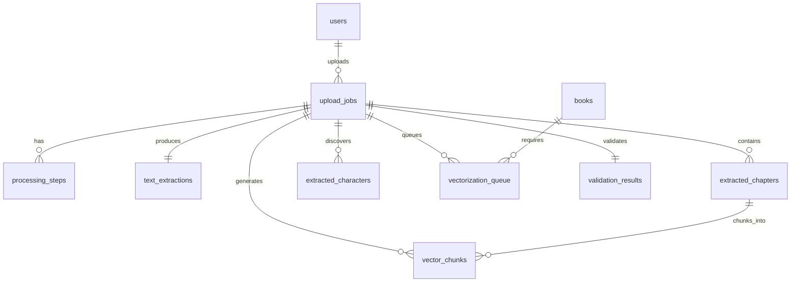

# DB-005: Upload Processing and Vectorization Tables

## Task Information
- **Task ID**: DB-005
- **Title**: Create Upload Processing Pipeline and Vectorization Tables
- **Priority**: P1 (High - Enables user content contribution)
- **Estimated Hours**: 8
- **Dependencies**: DB-001, DB-002 (Users), DB-003 (Books)
- **Related API Specs**: /uploads/*, Processing pipeline workflow

## Database Schema Design

### 1. Upload Jobs Table (upload.upload_jobs)

```sql
-- Main upload tracking table
CREATE TABLE upload.upload_jobs (
    id UUID PRIMARY KEY DEFAULT uuid_generate_v4(),
    upload_id VARCHAR(50) UNIQUE NOT NULL DEFAULT generate_short_id('upl'),
    user_id UUID NOT NULL REFERENCES auth.users(id) ON DELETE CASCADE,

    -- File information
    original_filename VARCHAR(500) NOT NULL,
    sanitized_filename VARCHAR(500),
    file_type VARCHAR(10) NOT NULL CHECK (file_type IN ('txt', 'pdf', 'epub', 'docx')),
    file_size INTEGER NOT NULL, -- bytes
    file_hash VARCHAR(64), -- SHA-256 hash for deduplication
    storage_path VARCHAR(1000), -- S3/local path

    -- Book metadata (user provided)
    title VARCHAR(500) NOT NULL,
    author VARCHAR(255) NOT NULL,
    category VARCHAR(50),
    description TEXT,
    language VARCHAR(10) DEFAULT 'zh-CN',

    -- Processing status
    status upload_status DEFAULT 'pending',
    current_step VARCHAR(50),
    progress INTEGER DEFAULT 0 CHECK (progress >= 0 AND progress <= 100),

    -- Processing results
    book_id UUID REFERENCES content.books(id) ON DELETE SET NULL,
    ai_known BOOLEAN,
    requires_vectorization BOOLEAN,
    duplicate_book_id UUID REFERENCES content.books(id) ON DELETE SET NULL,

    -- Quality metrics
    text_quality_score DECIMAL(3,2), -- 0-1 score
    content_completeness DECIMAL(3,2), -- 0-1 score

    -- Rewards
    points_earned INTEGER DEFAULT 0,
    points_awarded_at TIMESTAMP,

    -- Error handling
    error_code VARCHAR(50),
    error_message TEXT,
    retry_count INTEGER DEFAULT 0,

    -- Timestamps
    started_at TIMESTAMP,
    completed_at TIMESTAMP,
    created_at TIMESTAMP DEFAULT CURRENT_TIMESTAMP,
    updated_at TIMESTAMP DEFAULT CURRENT_TIMESTAMP
);

-- Create indexes
CREATE INDEX idx_upload_jobs_user_id ON upload.upload_jobs(user_id);
CREATE INDEX idx_upload_jobs_status ON upload.upload_jobs(status);
CREATE INDEX idx_upload_jobs_file_hash ON upload.upload_jobs(file_hash);
CREATE INDEX idx_upload_jobs_book_id ON upload.upload_jobs(book_id) WHERE book_id IS NOT NULL;
CREATE INDEX idx_upload_jobs_created_at ON upload.upload_jobs(created_at DESC);

-- Add trigger for updated_at
CREATE TRIGGER update_upload_jobs_updated_at BEFORE UPDATE ON upload.upload_jobs
    FOR EACH ROW EXECUTE FUNCTION update_updated_at_column();
```

### 2. Processing Steps Table (upload.processing_steps)

```sql
-- Track individual processing steps
CREATE TABLE upload.processing_steps (
    id UUID PRIMARY KEY DEFAULT uuid_generate_v4(),
    upload_id UUID NOT NULL REFERENCES upload.upload_jobs(id) ON DELETE CASCADE,
    step_name VARCHAR(50) NOT NULL,
    step_order INTEGER NOT NULL,
    status processing_step_status DEFAULT 'pending',
    progress INTEGER DEFAULT 0 CHECK (progress >= 0 AND progress <= 100),

    -- Step details
    input_data JSONB,
    output_data JSONB,
    metrics JSONB, -- {processing_time_ms, items_processed, etc}

    -- Error handling
    error_code VARCHAR(50),
    error_message TEXT,
    retry_count INTEGER DEFAULT 0,

    -- Timestamps
    started_at TIMESTAMP,
    completed_at TIMESTAMP,
    created_at TIMESTAMP DEFAULT CURRENT_TIMESTAMP,

    CONSTRAINT processing_steps_unique UNIQUE(upload_id, step_name)
);

-- Create indexes
CREATE INDEX idx_processing_steps_upload_id ON upload.processing_steps(upload_id);
CREATE INDEX idx_processing_steps_status ON upload.processing_steps(status);
CREATE INDEX idx_processing_steps_step_name ON upload.processing_steps(step_name);
```

### 3. Text Extraction Table (upload.text_extractions)

```sql
-- Extracted and processed text from uploads
CREATE TABLE upload.text_extractions (
    id UUID PRIMARY KEY DEFAULT uuid_generate_v4(),
    upload_id UUID NOT NULL REFERENCES upload.upload_jobs(id) ON DELETE CASCADE,

    -- Extraction results
    raw_text TEXT,
    cleaned_text TEXT,
    text_length INTEGER,
    detected_language VARCHAR(10),
    encoding VARCHAR(20),

    -- Structure detection
    has_chapters BOOLEAN DEFAULT false,
    chapter_count INTEGER,
    has_table_of_contents BOOLEAN DEFAULT false,
    has_index BOOLEAN DEFAULT false,

    -- Content analysis
    main_topics TEXT[],
    key_entities TEXT[], -- Detected people, places, concepts
    sentiment_score DECIMAL(3,2), -- -1 to 1
    reading_level VARCHAR(20), -- elementary, intermediate, advanced

    created_at TIMESTAMP DEFAULT CURRENT_TIMESTAMP,
    updated_at TIMESTAMP DEFAULT CURRENT_TIMESTAMP
);

-- Create indexes
CREATE INDEX idx_text_extractions_upload_id ON upload.text_extractions(upload_id);
CREATE INDEX idx_text_extractions_language ON upload.text_extractions(detected_language);

-- Add trigger for updated_at
CREATE TRIGGER update_text_extractions_updated_at BEFORE UPDATE ON upload.text_extractions
    FOR EACH ROW EXECUTE FUNCTION update_updated_at_column();
```

### 4. Chapter Extraction Table (upload.extracted_chapters)

```sql
-- Chapters extracted from uploaded books
CREATE TABLE upload.extracted_chapters (
    id UUID PRIMARY KEY DEFAULT uuid_generate_v4(),
    upload_id UUID NOT NULL REFERENCES upload.upload_jobs(id) ON DELETE CASCADE,
    chapter_number INTEGER NOT NULL,
    chapter_title VARCHAR(500),
    start_position INTEGER, -- Character position in text
    end_position INTEGER,
    content TEXT,
    word_count INTEGER,

    -- Processing flags
    needs_vectorization BOOLEAN DEFAULT true,
    vectorization_complete BOOLEAN DEFAULT false,

    created_at TIMESTAMP DEFAULT CURRENT_TIMESTAMP,

    CONSTRAINT extracted_chapters_unique UNIQUE(upload_id, chapter_number)
);

-- Create indexes
CREATE INDEX idx_extracted_chapters_upload_id ON upload.extracted_chapters(upload_id);
CREATE INDEX idx_extracted_chapters_number ON upload.extracted_chapters(upload_id, chapter_number);
CREATE INDEX idx_extracted_chapters_vectorization ON upload.extracted_chapters(needs_vectorization)
    WHERE needs_vectorization = true;
```

### 5. Character Extraction Table (upload.extracted_characters)

```sql
-- Characters detected from uploaded books
CREATE TABLE upload.extracted_characters (
    id UUID PRIMARY KEY DEFAULT uuid_generate_v4(),
    upload_id UUID NOT NULL REFERENCES upload.upload_jobs(id) ON DELETE CASCADE,
    character_name VARCHAR(200) NOT NULL,
    alternative_names TEXT[],

    -- Character analysis
    appearance_count INTEGER DEFAULT 0,
    first_appearance_chapter INTEGER,
    importance_score DECIMAL(3,2), -- 0-1 based on mentions

    -- Extracted information
    description TEXT,
    extracted_traits TEXT[],
    relationships JSONB, -- {character_name: relationship_type}
    key_quotes TEXT[],

    -- Approval status
    approved_for_dialogue BOOLEAN DEFAULT false,
    approval_notes TEXT,

    created_at TIMESTAMP DEFAULT CURRENT_TIMESTAMP,
    updated_at TIMESTAMP DEFAULT CURRENT_TIMESTAMP
);

-- Create indexes
CREATE INDEX idx_extracted_characters_upload_id ON upload.extracted_characters(upload_id);
CREATE INDEX idx_extracted_characters_name ON upload.extracted_characters(character_name);
CREATE INDEX idx_extracted_characters_approved ON upload.extracted_characters(approved_for_dialogue);

-- Add trigger for updated_at
CREATE TRIGGER update_extracted_characters_updated_at BEFORE UPDATE ON upload.extracted_characters
    FOR EACH ROW EXECUTE FUNCTION update_updated_at_column();
```

### 6. Vectorization Queue Table (upload.vectorization_queue)

```sql
-- Queue for vectorization tasks
CREATE TABLE upload.vectorization_queue (
    id UUID PRIMARY KEY DEFAULT uuid_generate_v4(),
    upload_id UUID REFERENCES upload.upload_jobs(id) ON DELETE CASCADE,
    book_id UUID REFERENCES content.books(id) ON DELETE CASCADE,
    chapter_id UUID REFERENCES upload.extracted_chapters(id) ON DELETE CASCADE,

    -- Queue management
    priority INTEGER DEFAULT 5, -- 1-10, 1 is highest
    status VARCHAR(20) DEFAULT 'pending' CHECK (status IN ('pending', 'processing', 'completed', 'failed')),
    worker_id VARCHAR(100), -- Processing worker identifier

    -- Chunking configuration
    chunk_size INTEGER DEFAULT 512, -- tokens per chunk
    overlap_size INTEGER DEFAULT 50, -- overlap between chunks

    -- Processing metrics
    total_chunks INTEGER,
    processed_chunks INTEGER DEFAULT 0,
    processing_time_ms INTEGER,

    -- Error handling
    error_message TEXT,
    retry_count INTEGER DEFAULT 0,
    max_retries INTEGER DEFAULT 3,

    -- Timestamps
    queued_at TIMESTAMP DEFAULT CURRENT_TIMESTAMP,
    started_at TIMESTAMP,
    completed_at TIMESTAMP,

    CONSTRAINT vectorization_queue_source CHECK (
        (upload_id IS NOT NULL AND book_id IS NULL) OR
        (upload_id IS NULL AND book_id IS NOT NULL)
    )
);

-- Create indexes
CREATE INDEX idx_vectorization_queue_status ON upload.vectorization_queue(status, priority);
CREATE INDEX idx_vectorization_queue_upload_id ON upload.vectorization_queue(upload_id) WHERE upload_id IS NOT NULL;
CREATE INDEX idx_vectorization_queue_book_id ON upload.vectorization_queue(book_id) WHERE book_id IS NOT NULL;
CREATE INDEX idx_vectorization_queue_worker ON upload.vectorization_queue(worker_id) WHERE worker_id IS NOT NULL;
```

### 7. Vector Chunks Table (upload.vector_chunks)

```sql
-- Chunks created for vectorization
CREATE TABLE upload.vector_chunks (
    id UUID PRIMARY KEY DEFAULT uuid_generate_v4(),
    source_id UUID NOT NULL, -- Can be upload_id or book_id
    source_type VARCHAR(20) NOT NULL CHECK (source_type IN ('upload', 'book')),
    chapter_number INTEGER,
    chunk_index INTEGER NOT NULL,
    chunk_text TEXT NOT NULL,
    chunk_tokens INTEGER,

    -- Vector storage reference
    chromadb_id VARCHAR(100) UNIQUE, -- ChromaDB document ID
    embedding_model VARCHAR(100),
    embedding_dimension INTEGER,

    -- Metadata for retrieval
    metadata JSONB, -- {page, paragraph, context, etc}

    created_at TIMESTAMP DEFAULT CURRENT_TIMESTAMP
);

-- Create indexes
CREATE INDEX idx_vector_chunks_source ON upload.vector_chunks(source_id, source_type);
CREATE INDEX idx_vector_chunks_chapter ON upload.vector_chunks(source_id, chapter_number, chunk_index);
CREATE INDEX idx_vector_chunks_chromadb ON upload.vector_chunks(chromadb_id);
```

### 8. Upload Validation Table (upload.validation_results)

```sql
-- Validation and quality checks
CREATE TABLE upload.validation_results (
    id UUID PRIMARY KEY DEFAULT uuid_generate_v4(),
    upload_id UUID NOT NULL REFERENCES upload.upload_jobs(id) ON DELETE CASCADE,

    -- Content validation
    has_copyright_issues BOOLEAN DEFAULT false,
    copyright_check_details TEXT,
    has_inappropriate_content BOOLEAN DEFAULT false,
    inappropriate_content_details TEXT,

    -- Quality validation
    text_quality_issues TEXT[],
    formatting_issues TEXT[],
    language_consistency BOOLEAN DEFAULT true,

    -- Duplicate detection
    is_duplicate BOOLEAN DEFAULT false,
    duplicate_book_ids UUID[],
    similarity_scores JSONB, -- {book_id: score}

    -- AI knowledge check
    ai_knowledge_checked BOOLEAN DEFAULT false,
    ai_knows_book BOOLEAN,
    ai_confidence_score DECIMAL(3,2),

    -- Final decision
    validation_passed BOOLEAN,
    rejection_reason TEXT,
    validated_by VARCHAR(20) DEFAULT 'system', -- 'system' or 'admin'

    created_at TIMESTAMP DEFAULT CURRENT_TIMESTAMP,
    updated_at TIMESTAMP DEFAULT CURRENT_TIMESTAMP
);

-- Create indexes
CREATE INDEX idx_validation_results_upload_id ON upload.validation_results(upload_id);
CREATE INDEX idx_validation_results_passed ON upload.validation_results(validation_passed);

-- Add trigger for updated_at
CREATE TRIGGER update_validation_results_updated_at BEFORE UPDATE ON upload.validation_results
    FOR EACH ROW EXECUTE FUNCTION update_updated_at_column();
```

### 9. Upload Statistics Table (upload.upload_statistics)

```sql
-- Aggregated upload statistics (materialized view)
CREATE MATERIALIZED VIEW upload.upload_statistics AS
SELECT
    u.user_id,
    COUNT(DISTINCT uj.id) as total_uploads,
    COUNT(DISTINCT uj.id) FILTER (WHERE uj.status = 'completed') as successful_uploads,
    COUNT(DISTINCT uj.id) FILTER (WHERE uj.status = 'failed') as failed_uploads,
    COUNT(DISTINCT uj.book_id) as books_created,
    SUM(uj.points_earned) as total_points_earned,
    AVG(EXTRACT(EPOCH FROM (uj.completed_at - uj.created_at))/60)::DECIMAL(8,2) as avg_processing_time_minutes,
    MAX(uj.created_at) as last_upload_at
FROM auth.users u
LEFT JOIN upload.upload_jobs uj ON u.id = uj.user_id
GROUP BY u.user_id;

-- Create indexes
CREATE UNIQUE INDEX idx_upload_statistics_user_id ON upload.upload_statistics(user_id);
CREATE INDEX idx_upload_statistics_uploads ON upload.upload_statistics(total_uploads DESC);
```

## Table Relationships



## Performance Optimization

### Queue Processing
```sql
-- Function to claim vectorization tasks
CREATE OR REPLACE FUNCTION claim_vectorization_tasks(
    worker_name VARCHAR(100),
    batch_size INTEGER DEFAULT 10
)
RETURNS TABLE(task_id UUID) AS $$
BEGIN
    RETURN QUERY
    UPDATE upload.vectorization_queue
    SET
        status = 'processing',
        worker_id = worker_name,
        started_at = CURRENT_TIMESTAMP
    WHERE id IN (
        SELECT id
        FROM upload.vectorization_queue
        WHERE status = 'pending'
          AND retry_count < max_retries
        ORDER BY priority ASC, queued_at ASC
        LIMIT batch_size
        FOR UPDATE SKIP LOCKED
    )
    RETURNING id;
END;
$$ LANGUAGE plpgsql;
```

### Deduplication Check
```sql
-- Function to check for duplicate uploads
CREATE OR REPLACE FUNCTION check_duplicate_upload(
    file_hash_param VARCHAR(64),
    title_param VARCHAR(500),
    author_param VARCHAR(255)
)
RETURNS TABLE(
    is_duplicate BOOLEAN,
    duplicate_id UUID,
    similarity_score DECIMAL
) AS $$
BEGIN
    RETURN QUERY
    SELECT
        TRUE,
        b.id,
        GREATEST(
            similarity(title_param, b.title),
            similarity(author_param, b.author)
        )::DECIMAL(3,2)
    FROM content.books b
    WHERE b.deleted_at IS NULL
      AND (
        EXISTS (
            SELECT 1 FROM upload.upload_jobs uj
            WHERE uj.book_id = b.id
              AND uj.file_hash = file_hash_param
        )
        OR (
            similarity(title_param, b.title) > 0.8
            AND similarity(author_param, b.author) > 0.8
        )
    )
    ORDER BY GREATEST(
        similarity(title_param, b.title),
        similarity(author_param, b.author)
    ) DESC
    LIMIT 1;
END;
$$ LANGUAGE plpgsql;
```

## Migration Scripts

### Create Tables
```bash
#!/bin/bash
# create_upload_tables.sh

psql -d inknowing_db << EOF
\i 005_01_create_upload_jobs_table.sql
\i 005_02_create_processing_steps_table.sql
\i 005_03_create_text_extractions_table.sql
\i 005_04_create_extracted_chapters_table.sql
\i 005_05_create_extracted_characters_table.sql
\i 005_06_create_vectorization_queue_table.sql
\i 005_07_create_vector_chunks_table.sql
\i 005_08_create_validation_results_table.sql
\i 005_09_create_upload_statistics_view.sql
\i 005_10_create_processing_functions.sql
EOF
```

### Rollback Strategy
```sql
-- rollback_upload_tables.sql
DROP MATERIALIZED VIEW IF EXISTS upload.upload_statistics CASCADE;
DROP TABLE IF EXISTS upload.validation_results CASCADE;
DROP TABLE IF EXISTS upload.vector_chunks CASCADE;
DROP TABLE IF EXISTS upload.vectorization_queue CASCADE;
DROP TABLE IF EXISTS upload.extracted_characters CASCADE;
DROP TABLE IF EXISTS upload.extracted_chapters CASCADE;
DROP TABLE IF EXISTS upload.text_extractions CASCADE;
DROP TABLE IF EXISTS upload.processing_steps CASCADE;
DROP TABLE IF EXISTS upload.upload_jobs CASCADE;

DROP FUNCTION IF EXISTS claim_vectorization_tasks(VARCHAR, INTEGER) CASCADE;
DROP FUNCTION IF EXISTS check_duplicate_upload(VARCHAR, VARCHAR, VARCHAR) CASCADE;
```

## Test Cases

### 1. Upload Creation Test
```sql
-- Create upload job
INSERT INTO upload.upload_jobs (user_id, original_filename, file_type, file_size, title, author)
SELECT
    id,
    'test_book.pdf',
    'pdf',
    2048000,
    'Test Book',
    'Test Author'
FROM auth.users LIMIT 1
RETURNING upload_id;

-- Add processing steps
INSERT INTO upload.processing_steps (upload_id, step_name, step_order)
SELECT
    id,
    step,
    row_number() OVER ()
FROM upload.upload_jobs,
    unnest(ARRAY[
        'ai_detection',
        'text_preprocessing',
        'chapter_extraction',
        'character_extraction',
        'vectorization'
    ]) AS step
WHERE upload_id = (SELECT upload_id FROM upload.upload_jobs LIMIT 1);
```

### 2. Text Extraction Test
```sql
-- Add extraction results
INSERT INTO upload.text_extractions (upload_id, raw_text, cleaned_text, text_length, has_chapters, chapter_count)
SELECT
    id,
    'Raw text content...',
    'Cleaned text content...',
    5000,
    true,
    10
FROM upload.upload_jobs LIMIT 1;

-- Extract chapters
INSERT INTO upload.extracted_chapters (upload_id, chapter_number, chapter_title, content, word_count)
SELECT
    uj.id,
    chapter_num,
    'Chapter ' || chapter_num,
    'Chapter content...',
    500
FROM upload.upload_jobs uj,
    generate_series(1, 10) AS chapter_num
WHERE uj.upload_id = (SELECT upload_id FROM upload.upload_jobs LIMIT 1);
```

### 3. Vectorization Queue Test
```sql
-- Add to vectorization queue
INSERT INTO upload.vectorization_queue (upload_id, priority)
SELECT id, 5
FROM upload.upload_jobs
WHERE status = 'processing' AND ai_known = false;

-- Claim tasks
SELECT * FROM claim_vectorization_tasks('worker_001', 5);

-- Complete task
UPDATE upload.vectorization_queue
SET
    status = 'completed',
    completed_at = CURRENT_TIMESTAMP,
    processed_chunks = total_chunks
WHERE worker_id = 'worker_001' AND status = 'processing';
```

### 4. Duplicate Detection Test
```sql
-- Check for duplicates
SELECT * FROM check_duplicate_upload(
    'abc123hash',
    'Existing Book Title',
    'Known Author'
);
```

### 5. Performance Test
```sql
-- Bulk upload simulation
INSERT INTO upload.upload_jobs (user_id, original_filename, file_type, file_size, title, author, status)
SELECT
    (SELECT id FROM auth.users ORDER BY RANDOM() LIMIT 1),
    'book_' || i || '.txt',
    'txt',
    1000000 + (random() * 9000000)::INTEGER,
    'Book Title ' || i,
    'Author ' || (i % 100),
    (ARRAY['pending', 'processing', 'completed', 'failed'])[floor(random() * 4 + 1)]
FROM generate_series(1, 1000) i;

-- Test queue performance
EXPLAIN ANALYZE
SELECT * FROM upload.vectorization_queue
WHERE status = 'pending'
ORDER BY priority ASC, queued_at ASC
LIMIT 10;
-- Expected: < 5ms
```

## Success Criteria
- [ ] All tables created successfully
- [ ] Upload pipeline tracking working
- [ ] Vectorization queue processing efficiently
- [ ] Duplicate detection functioning
- [ ] Processing steps tracked correctly
- [ ] Statistics view updating properly
- [ ] Performance benchmarks met (< 10ms for queue operations)
- [ ] All test cases passing

## Notes
- File storage (S3/local) handled at application level
- ChromaDB integration for vector storage
- Text extraction tools (PyPDF2, etc.) at application level
- Consider implementing progress notifications via WebSocket
- Points calculation based on book quality and uniqueness