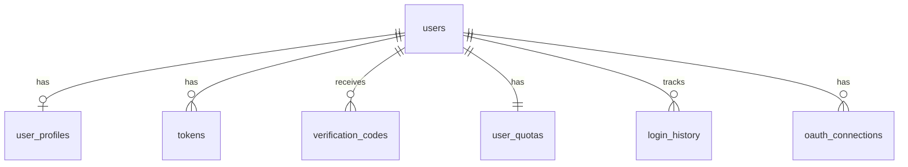

# DB-002: User Authentication and Profile Tables

## Task Information
- **Task ID**: DB-002
- **Title**: Create User Authentication and Profile Tables
- **Priority**: P0 (Critical - Required for all user operations)
- **Estimated Hours**: 6
- **Dependencies**: DB-001 (Database Initialization)
- **Related API Specs**: /auth/*, /users/*

## Database Schema Design

### 1. Users Table (auth.users)

```sql
-- Main users table
CREATE TABLE auth.users (
    id UUID PRIMARY KEY DEFAULT uuid_generate_v4(),
    username VARCHAR(50) UNIQUE NOT NULL,
    phone VARCHAR(20) UNIQUE,
    phone_verified BOOLEAN DEFAULT false,
    wechat_openid VARCHAR(100) UNIQUE,
    wechat_unionid VARCHAR(100),
    email VARCHAR(255) UNIQUE,
    password_hash VARCHAR(255), -- bcrypt hash
    avatar VARCHAR(500),
    nickname VARCHAR(100) NOT NULL,
    membership membership_type DEFAULT 'free',
    membership_expires_at TIMESTAMP,
    points INTEGER DEFAULT 0 CHECK (points >= 0),
    status user_status DEFAULT 'active',
    last_login_at TIMESTAMP,
    login_count INTEGER DEFAULT 0,
    created_at TIMESTAMP DEFAULT CURRENT_TIMESTAMP,
    updated_at TIMESTAMP DEFAULT CURRENT_TIMESTAMP,
    deleted_at TIMESTAMP, -- Soft delete

    -- Constraints
    CONSTRAINT users_phone_or_wechat CHECK (
        phone IS NOT NULL OR wechat_openid IS NOT NULL
    ),
    CONSTRAINT users_valid_phone CHECK (
        phone IS NULL OR phone ~ '^1[3-9]\d{9}$'
    )
);

-- Create indexes
CREATE INDEX idx_users_phone ON auth.users(phone) WHERE phone IS NOT NULL;
CREATE INDEX idx_users_wechat_openid ON auth.users(wechat_openid) WHERE wechat_openid IS NOT NULL;
CREATE INDEX idx_users_email ON auth.users(email) WHERE email IS NOT NULL;
CREATE INDEX idx_users_membership ON auth.users(membership);
CREATE INDEX idx_users_status ON auth.users(status) WHERE status != 'deleted';
CREATE INDEX idx_users_created_at ON auth.users(created_at DESC);

-- Add trigger for updated_at
CREATE TRIGGER update_users_updated_at BEFORE UPDATE ON auth.users
    FOR EACH ROW EXECUTE FUNCTION update_updated_at_column();
```

### 2. User Profiles Table (auth.user_profiles)

```sql
-- Extended user profile information
CREATE TABLE auth.user_profiles (
    user_id UUID PRIMARY KEY REFERENCES auth.users(id) ON DELETE CASCADE,
    bio TEXT,
    interests TEXT[],
    preferred_categories TEXT[],
    reading_goal INTEGER, -- Books per month
    notification_settings JSONB DEFAULT '{"email": true, "push": true, "sms": false}'::jsonb,
    privacy_settings JSONB DEFAULT '{"profile_public": false, "show_reading_list": false}'::jsonb,
    language VARCHAR(10) DEFAULT 'zh-CN',
    timezone VARCHAR(50) DEFAULT 'Asia/Shanghai',
    created_at TIMESTAMP DEFAULT CURRENT_TIMESTAMP,
    updated_at TIMESTAMP DEFAULT CURRENT_TIMESTAMP
);

-- Create indexes
CREATE INDEX idx_user_profiles_interests ON auth.user_profiles USING GIN(interests);
CREATE INDEX idx_user_profiles_categories ON auth.user_profiles USING GIN(preferred_categories);

-- Add trigger for updated_at
CREATE TRIGGER update_user_profiles_updated_at BEFORE UPDATE ON auth.user_profiles
    FOR EACH ROW EXECUTE FUNCTION update_updated_at_column();
```

### 3. Authentication Tokens Table (auth.tokens)

```sql
-- JWT refresh tokens and session management
CREATE TABLE auth.tokens (
    id UUID PRIMARY KEY DEFAULT uuid_generate_v4(),
    user_id UUID NOT NULL REFERENCES auth.users(id) ON DELETE CASCADE,
    token_hash VARCHAR(255) NOT NULL, -- SHA256 hash of token
    token_type VARCHAR(20) NOT NULL DEFAULT 'refresh', -- 'refresh', 'access', 'api_key'
    device_info JSONB, -- {device_type, os, browser, ip}
    expires_at TIMESTAMP NOT NULL,
    revoked_at TIMESTAMP,
    last_used_at TIMESTAMP,
    created_at TIMESTAMP DEFAULT CURRENT_TIMESTAMP,

    CONSTRAINT tokens_unique_active UNIQUE(user_id, token_hash, token_type)
);

-- Create indexes
CREATE INDEX idx_tokens_user_id ON auth.tokens(user_id);
CREATE INDEX idx_tokens_token_hash ON auth.tokens(token_hash);
CREATE INDEX idx_tokens_expires_at ON auth.tokens(expires_at) WHERE revoked_at IS NULL;
CREATE INDEX idx_tokens_type ON auth.tokens(token_type);
```

### 4. Verification Codes Table (auth.verification_codes)

```sql
-- SMS and email verification codes
CREATE TABLE auth.verification_codes (
    id UUID PRIMARY KEY DEFAULT uuid_generate_v4(),
    user_id UUID REFERENCES auth.users(id) ON DELETE CASCADE,
    contact VARCHAR(255) NOT NULL, -- Phone or email
    code VARCHAR(10) NOT NULL,
    code_type VARCHAR(20) NOT NULL, -- 'sms', 'email'
    purpose VARCHAR(50) NOT NULL, -- 'registration', 'login', 'reset_password'
    attempts INTEGER DEFAULT 0,
    verified_at TIMESTAMP,
    expires_at TIMESTAMP NOT NULL,
    created_at TIMESTAMP DEFAULT CURRENT_TIMESTAMP,

    CONSTRAINT verification_codes_max_attempts CHECK (attempts <= 5)
);

-- Create indexes
CREATE INDEX idx_verification_codes_contact ON auth.verification_codes(contact);
CREATE INDEX idx_verification_codes_code ON auth.verification_codes(code, contact) WHERE verified_at IS NULL;
CREATE INDEX idx_verification_codes_expires ON auth.verification_codes(expires_at) WHERE verified_at IS NULL;
```

### 5. User Quota Table (auth.user_quotas)

```sql
-- Track user dialogue quotas
CREATE TABLE auth.user_quotas (
    user_id UUID PRIMARY KEY REFERENCES auth.users(id) ON DELETE CASCADE,
    quota_total INTEGER NOT NULL, -- Total quota for period
    quota_used INTEGER DEFAULT 0, -- Used quota in current period
    quota_reset_at TIMESTAMP NOT NULL, -- When quota resets
    extra_quota INTEGER DEFAULT 0, -- Admin granted extra quota
    period_start TIMESTAMP NOT NULL,
    last_usage_at TIMESTAMP,
    created_at TIMESTAMP DEFAULT CURRENT_TIMESTAMP,
    updated_at TIMESTAMP DEFAULT CURRENT_TIMESTAMP,

    CONSTRAINT quota_usage_valid CHECK (quota_used >= 0 AND quota_used <= quota_total + extra_quota)
);

-- Create indexes
CREATE INDEX idx_user_quotas_reset_at ON auth.user_quotas(quota_reset_at);
CREATE INDEX idx_user_quotas_usage ON auth.user_quotas(quota_used, quota_total);

-- Add trigger for updated_at
CREATE TRIGGER update_user_quotas_updated_at BEFORE UPDATE ON auth.user_quotas
    FOR EACH ROW EXECUTE FUNCTION update_updated_at_column();
```

### 6. Login History Table (auth.login_history)

```sql
-- Track login attempts and history
CREATE TABLE auth.login_history (
    id UUID PRIMARY KEY DEFAULT uuid_generate_v4(),
    user_id UUID REFERENCES auth.users(id) ON DELETE CASCADE,
    login_method VARCHAR(20) NOT NULL, -- 'phone', 'wechat', 'password'
    ip_address INET,
    user_agent TEXT,
    device_fingerprint VARCHAR(255),
    location JSONB, -- {country, city, lat, lng}
    success BOOLEAN NOT NULL,
    failure_reason VARCHAR(100), -- 'invalid_password', 'account_locked', etc.
    created_at TIMESTAMP DEFAULT CURRENT_TIMESTAMP
);

-- Create indexes
CREATE INDEX idx_login_history_user_id ON auth.login_history(user_id);
CREATE INDEX idx_login_history_created_at ON auth.login_history(created_at DESC);
CREATE INDEX idx_login_history_ip ON auth.login_history(ip_address);
CREATE INDEX idx_login_history_success ON auth.login_history(success);

-- Partition by month for performance
CREATE TABLE auth.login_history_2024_01 PARTITION OF auth.login_history
    FOR VALUES FROM ('2024-01-01') TO ('2024-02-01');
```

### 7. OAuth Connections Table (auth.oauth_connections)

```sql
-- Store OAuth connections (WeChat, etc.)
CREATE TABLE auth.oauth_connections (
    id UUID PRIMARY KEY DEFAULT uuid_generate_v4(),
    user_id UUID NOT NULL REFERENCES auth.users(id) ON DELETE CASCADE,
    provider VARCHAR(50) NOT NULL, -- 'wechat', 'weibo', etc.
    provider_user_id VARCHAR(255) NOT NULL,
    access_token TEXT,
    refresh_token TEXT,
    token_expires_at TIMESTAMP,
    provider_data JSONB, -- Full provider response
    created_at TIMESTAMP DEFAULT CURRENT_TIMESTAMP,
    updated_at TIMESTAMP DEFAULT CURRENT_TIMESTAMP,

    CONSTRAINT oauth_unique_provider UNIQUE(provider, provider_user_id)
);

-- Create indexes
CREATE INDEX idx_oauth_connections_user_id ON auth.oauth_connections(user_id);
CREATE INDEX idx_oauth_connections_provider ON auth.oauth_connections(provider, provider_user_id);

-- Add trigger for updated_at
CREATE TRIGGER update_oauth_connections_updated_at BEFORE UPDATE ON auth.oauth_connections
    FOR EACH ROW EXECUTE FUNCTION update_updated_at_column();
```

## Table Relationships



## Index Strategy

### Primary Indexes
- UUID primary keys with automatic B-tree indexes
- Foreign key indexes for all references

### Secondary Indexes
- Phone, email, WeChat ID for authentication lookups
- Membership type for filtering and quota calculations
- Token hashes for validation
- Timestamp indexes for cleanup jobs

### Full-text Search Indexes
- GIN indexes on array fields (interests, categories)
- JSONB indexes for settings fields

## Performance Optimization

### Query Optimization
```sql
-- Common query: User login by phone
EXPLAIN ANALYZE
SELECT u.*, uq.quota_used, uq.quota_total
FROM auth.users u
LEFT JOIN auth.user_quotas uq ON u.id = uq.user_id
WHERE u.phone = '13800138000' AND u.status = 'active';

-- Common query: Check token validity
EXPLAIN ANALYZE
SELECT * FROM auth.tokens
WHERE token_hash = 'hash_value'
  AND expires_at > CURRENT_TIMESTAMP
  AND revoked_at IS NULL;
```

### Caching Strategy
- User sessions cached in Redis with 30-minute TTL
- Quota information cached with 5-minute TTL
- Verification codes stored in Redis for quick validation

## Security and Compliance

### Data Encryption
```sql
-- Function to hash passwords (called from application)
CREATE OR REPLACE FUNCTION auth.hash_password(password TEXT)
RETURNS TEXT AS $$
BEGIN
    RETURN crypt(password, gen_salt('bf', 12));
END;
$$ LANGUAGE plpgsql SECURITY DEFINER;

-- Function to verify password
CREATE OR REPLACE FUNCTION auth.verify_password(password TEXT, hash TEXT)
RETURNS BOOLEAN AS $$
BEGIN
    RETURN hash = crypt(password, hash);
END;
$$ LANGUAGE plpgsql SECURITY DEFINER;
```

### Row Level Security
```sql
-- Enable RLS on sensitive tables
ALTER TABLE auth.users ENABLE ROW LEVEL SECURITY;
ALTER TABLE auth.user_profiles ENABLE ROW LEVEL SECURITY;

-- Policy: Users can only see their own data
CREATE POLICY users_self_policy ON auth.users
    FOR ALL
    USING (id = current_setting('app.current_user_id')::UUID);

CREATE POLICY profiles_self_policy ON auth.user_profiles
    FOR ALL
    USING (user_id = current_setting('app.current_user_id')::UUID);
```

## Migration Scripts

### Create Tables
```bash
#!/bin/bash
# create_user_tables.sh

psql -d inknowing_db << EOF
\i 002_01_create_users_table.sql
\i 002_02_create_user_profiles_table.sql
\i 002_03_create_tokens_table.sql
\i 002_04_create_verification_codes_table.sql
\i 002_05_create_user_quotas_table.sql
\i 002_06_create_login_history_table.sql
\i 002_07_create_oauth_connections_table.sql
\i 002_08_create_security_functions.sql
\i 002_09_apply_rls_policies.sql
EOF
```

### Rollback Strategy
```sql
-- rollback_user_tables.sql
DROP TABLE IF EXISTS auth.oauth_connections CASCADE;
DROP TABLE IF EXISTS auth.login_history CASCADE;
DROP TABLE IF EXISTS auth.user_quotas CASCADE;
DROP TABLE IF EXISTS auth.verification_codes CASCADE;
DROP TABLE IF EXISTS auth.tokens CASCADE;
DROP TABLE IF EXISTS auth.user_profiles CASCADE;
DROP TABLE IF EXISTS auth.users CASCADE;

DROP FUNCTION IF EXISTS auth.hash_password(TEXT);
DROP FUNCTION IF EXISTS auth.verify_password(TEXT, TEXT);
```

## Test Cases

### 1. User Registration Test
```sql
-- Test user creation with phone
INSERT INTO auth.users (username, phone, nickname, password_hash)
VALUES ('testuser1', '13800138000', 'Test User', auth.hash_password('password123'));

-- Verify user created
SELECT * FROM auth.users WHERE username = 'testuser1';

-- Test quota initialization
INSERT INTO auth.user_quotas (user_id, quota_total, quota_reset_at, period_start)
SELECT id, 20, calculate_quota_reset('free'), CURRENT_TIMESTAMP
FROM auth.users WHERE username = 'testuser1';
```

### 2. Authentication Test
```sql
-- Test password verification
SELECT auth.verify_password('password123', password_hash)
FROM auth.users WHERE username = 'testuser1';
-- Expected: true

-- Test token creation
INSERT INTO auth.tokens (user_id, token_hash, expires_at)
SELECT id, encode(sha256('test_token'::bytea), 'hex'), CURRENT_TIMESTAMP + interval '1 hour'
FROM auth.users WHERE username = 'testuser1';
```

### 3. Quota Management Test
```sql
-- Test quota usage
UPDATE auth.user_quotas
SET quota_used = quota_used + 1
WHERE user_id = (SELECT id FROM auth.users WHERE username = 'testuser1');

-- Test quota reset
UPDATE auth.user_quotas
SET quota_used = 0, quota_reset_at = calculate_quota_reset('free')
WHERE quota_reset_at < CURRENT_TIMESTAMP;
```

### 4. Performance Benchmark
```sql
-- Insert test data
INSERT INTO auth.users (username, phone, nickname, password_hash)
SELECT
    'user_' || i,
    '138' || lpad(i::text, 8, '0'),
    'User ' || i,
    auth.hash_password('password' || i)
FROM generate_series(1, 10000) i;

-- Test login query performance
EXPLAIN ANALYZE
SELECT * FROM auth.users WHERE phone = '13800005000';
-- Expected: < 1ms with index
```

### 5. Security Test
```sql
-- Test RLS policies
SET app.current_user_id = (SELECT id FROM auth.users LIMIT 1);
SELECT COUNT(*) FROM auth.users; -- Should only see 1 row

-- Test password hashing
SELECT length(auth.hash_password('test')) > 50; -- Should be true (bcrypt hash)
```

## Success Criteria
- [ ] All tables created successfully
- [ ] Indexes properly configured
- [ ] Triggers functioning correctly
- [ ] Security functions working
- [ ] RLS policies applied
- [ ] Performance benchmarks met (< 5ms for auth queries)
- [ ] All test cases passing

## Notes
- Phone number validation follows Chinese format (1[3-9]xxxxxxxx)
- WeChat integration requires additional API setup
- Password reset flow to be implemented at application level
- Consider implementing rate limiting at application level
- Redis session storage configuration handled separately